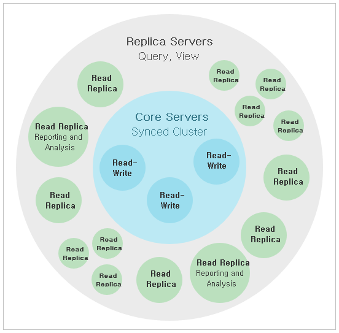

### 4.2.1. 소개 `Enterprise Edition`
> 이 장에서는 Neo4j Causal 클러스터링에 대해 소개합니다.

Neo4j의 Causal 클러스터링은 3가지 주요 기능을 제공합니다:
1. **안전:** 코어 서버는 해당 코어 서버의 단순 다수가 작동하는 동안 계속 사용 가능한 트랜잭션 처리를 위한 내결함성 플랫폼을 제공합니다.
2. **규모:** 읽기 복제본은 광범위하게 분산 된 토폴로지에서 매우 큰 그래프 작업 부하를 실행할 수 있게 해주는 그래프 쿼리들을 위한 대규모 확장성을 지닌 플랫폼을 제공합니다.
3. **인과 관계의 일관성:** 호출 될 때, 클라이언트 애플리케이션은 적어도 자신의 쓰기를 읽도록 보장됩니다.

이를 통해 최종 사용자 시스템이 여러 하드웨어 및 네트워크 장애 발생 시 완벽하게 작동할 수 있고, 데이터베이스에 읽기 및 쓰기 작업을 수행할 수 있으며, 데이터베이스 상호 작용에 대한 추론이 수월합니다.

이 장의 나머지 부분에서는 운영 및 애플리케이션 측면을 포함하여 Causal 클러스터링이 생산 분야에서 어떻게 작동하는지에 대한 개요를 제공할 것입니다.

#### 4.2.1.1. 운용적 관점
운영상의 관점에서, 클러스터는 코어와 읽기 복제본이라는 두 가지 다른 역할로 구성되어 있는 것으로 보는 것이 유용합니다.

##### 그림 4.4. Causal 클러스터 아키텍처

두 가지 역할은 모든 생산 배포에서 기본이지만 서로 다른 척도로 관리되며 전체 클러스터의 내결함성 및 확장성을 관리하는 데 다른 역할을 수행합니다.
