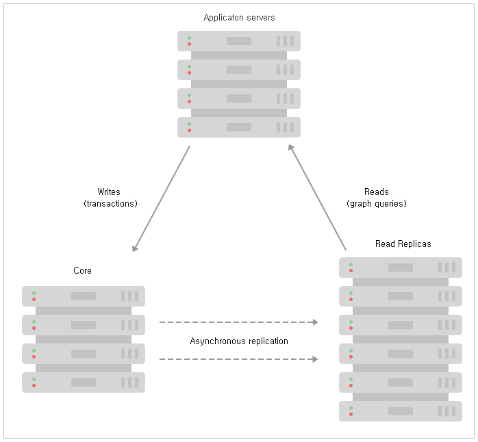

### 4.2.1. 소개 `Enterprise Edition`
> 이 장에서는 Neo4j Causal 클러스터링에 대해 소개합니다.

Neo4j의 Causal 클러스터링은 3가지 주요 기능을 제공합니다:
1. **안전:** 코어 서버는 해당 코어 서버의 단순 다수가 작동하는 동안 계속 사용 가능한 트랜잭션 처리를 위한 내결함성 플랫폼을 제공합니다.
2. **규모:** 읽기 복제본은 광범위하게 분산 된 토폴로지에서 매우 큰 그래프 작업 부하를 실행할 수 있게 해주는 그래프 쿼리들을 위한 대규모 확장성을 지닌 플랫폼을 제공합니다.
3. **인과 관계의 일관성:** 호출 될 때, 클라이언트 애플리케이션은 적어도 자신의 쓰기를 읽도록 보장됩니다.

이를 통해 최종 사용자 시스템이 여러 하드웨어 및 네트워크 장애 발생 시 완벽하게 작동할 수 있고, 데이터베이스에 읽기 및 쓰기 작업을 수행할 수 있으며, 데이터베이스 상호 작용에 대한 추론이 수월합니다.

이 장의 나머지 부분에서는 운영 및 애플리케이션 측면을 포함하여 Causal 클러스터링이 생산 분야에서 어떻게 작동하는지에 대한 개요를 제공할 것입니다.

#### 4.2.1.1. 운용적 관점
운영상의 관점에서, 클러스터는 코어와 읽기 복제본이라는 두 가지 다른 역할로 구성되어 있는 것으로 보는 것이 유용합니다.

##### 그림 4.4. Causal 클러스터 아키텍처

두 가지 역할은 모든 생산 배포에서 기본이지만 서로 다른 척도로 관리되며 전체 클러스터의 내결함성 및 확장성을 관리하는 데 다른 역할을 수행합니다.

**코어 서버**
코어 서버의 주요 책임은 데이터를 보호하는 것입니다. 코어 서버는 Raft 프로토콜을 사용하여 모든 트랜잭션을 복제함으로써 이를 수행합니다. Raft는 최종 사용자 응용 프로그램에 대한 트랜잭션 커밋을 확인하기 전에 데이터가 안전하게 지속될 수 있도록 합니다. 실제로 이는 클러스터의 코어 서버 대부분(`N/2 + 1`)이 트랜잭션을 수락하면 최종 사용자 응용 프로그램에 대한 커밋을 승인하는 것이 안전하다는 것을 의미합니다.

안전 요구 사항은 쓰기 대기 시간에 영향을 미칩니다. 암시적 쓰기는 가장 빠른 대다수에 의해 승인되지만 클러스터의 코어 서버 수가 증가함에 따라 쓰기를 승인하는 데 필요한 대다수의 크기도 증가합니다.

실제로 이는 일반적인 코어 서버 클러스터에 특정 배포에 대해 충분한 내결함성을 제공할 수 있는 시스템이 비교적 적다는 것을 의미합니다. 이것은 단순히 공식 `M = 2F + 1`로 계산됩니다. 여기서 `M`은 `F` 오류를 허용하는 데 필요한 코어 서버의 수입니다. 예를 들어, 실패한 코어 서버 2개를 허용하려면 클러스터 5개를 배포해야 합니다.

코어 서버 클러스터가 더 이상 쓰기를 처리할 수 없는 충분한 오류를 발생하면 그것은 안전을 유지하기 위해 읽기 전용으로 될 것입니다.

**Read Replica**
Read Replica의 주요 책임은 그래프 워크로드 (Cypher 쿼리, 프로시저 등)를 확장하는 것입니다. Read Replica는 코어 서버가 보호하는 데이터의 캐시처럼 작동하지만 단순한 키-값 캐시가 아닙니다. 사실상 Read Replica는 임의의 (읽기 전용) 그래프 쿼리 및 프로시저를 수행할 수 있는 완벽한 Neo4j 데이터베이스입니다.

Read Replica는 트랜잭션 로그 전달을 통해 코어 서버로부터 비동기적으로 복제됩니다. 주기적으로 (일반적으로 ms 범위에서) Read Replica는 마지막 폴링 이후 처리한 모든 새 트랜잭션에 대해 코어 서버를 폴링하고, 코어 서버는 해당 트랜잭션을 Read Replica로 전달합니다. 많은 Read Replica는 비교적 적은 수의 코어 서버에서 데이터를 공급받을 수 있으므로 스케일에 대한 쿼리 워크로드의 큰 전개를 수용할 수 있습니다.

그러나 코어 서버와 달리 Read Replica는 클러스터 토폴로지에 대한 의사 결정에 참여하지 않습니다. Read Replica는 일반적으로 비교적 많은 수로 실행하고 일회용으로 처리되어야 합니다. Read Replica 손실은 그래프 쿼리 처리량의 손실을 제외하고 클러스터 가용성에 영향을 미치지 않습니다. 그것은 클러스터의 내결함성 기능에는 영향을 주지 않습니다.

#### 4.2.1.2. 인과 관계의 일관성
클러스터의 운영 메커니즘이 애플리케이션 관점에서 흥미롭지만, 애플리케이션이 그들의 작업을 수행하기 위해 데이터베이스를 어떻게 사용하는 지에 대해 생각해 보는 것 또한 도움이 됩니다. 애플리케이션에서 우리는 일반적으로 그래프로부터 읽고 그래프에 쓰기를 원합니다. 워크로드의 성격에 따라 우리는 보통 인과 관계의 일관성을 보장하기 위해 이전 쓰기를 고려하려고 그래프로부터 읽기를 원합니다.

>> 인과 관계 일관성은 분산 컴퓨팅에서 사용되는 수많은 일관성 모델 중 하나입니다. 그것은 인과 관계가 있는 작업이 시스템의 모든 인스턴스에서 동일한 순서로 표시되도록 합니다. 클라이언트 애플리케이션은 오래된 데이터를 보지 않으며 단일 서버인 것처럼 데이터베이스와 (논리적으로) 상호 작용합니다. 결과적으로 클라이언트 애플리케이션은 대규모 클러스터와의 상호 작용도 간단하고 예측 가능하게 만드는 자신이 직접 쓴 것을 읽기 의미론(read-your-own-writes semantics)을 즐깁니다.

인과 관계의 일관성은 코어 서버 (데이터가 안전한 곳)에 쓰기와 Read Replica(그래프 작업이 수평으로 확장되는 곳)로부터 해당 쓰기의 읽기를 쉽게 합니다. 예를 들어, 인과 관계의 일관성은 동일한 사용자가 이후 로그인을 시도 할 때 사용자 계정을 생성한 쓰기가 제공됨을 보장합니다.

**그림 4.5. Neo4j 드라이버를 통한 인과 관계 일관성을 지닌 Causal 클러스터 설정**

트랜잭션을 실행할 때, 클라이언트는 후속 트랜잭션에 매개 변수로 제공되는 북마크를 요청할 수 있습니다. 이 북마크를 사용하여 클러스터는 클라이언트의 북마크된 트랜잭션을 처리한 서버만 다음 트랜잭션을 실행하도록 할 수 있습니다. 이것은 클라이언트의 관점에서 올바른 쓰기 이후에 읽기 의미론(read-after-write semantics)을 보장하는 *인과 관계 체인*을 제공합니다.

북마크 외에 다른 모든 것은 클러스터에 의해 처리됩니다. 데이터베이스 드라이버는 높은 서비스 품질을 제공하기 위하여 가장 적합한 코어 서버 및 Read Replica를 선택하도록 클러스터 토폴로지 관리자와 함께 작업합니다.

#### 4.2.1.3. 요약
이 장에서는 운영 및 응용 프로그램 개발의 관점에서 높은 수준의 Causal 클러스터링을 검토했습니다. 이제 우리는 클러스터의 코어 서버가 데이터의 장기 보관을 담당하는 반면, 더 많은 수의 Read Replica는 그래프 쿼리 워크 로드 확장을 위한 책임이 있음을 이해합니다. 이 강력한 아키텍처에 대한 추론은 인과 관계의 일관성과 같은 읽기 레벨을 쉽게 제공하기 위하여 클러스터 토폴로지를 추상화하는 Neo4j 드라이버에 의해 크게 단순화됩니다.
