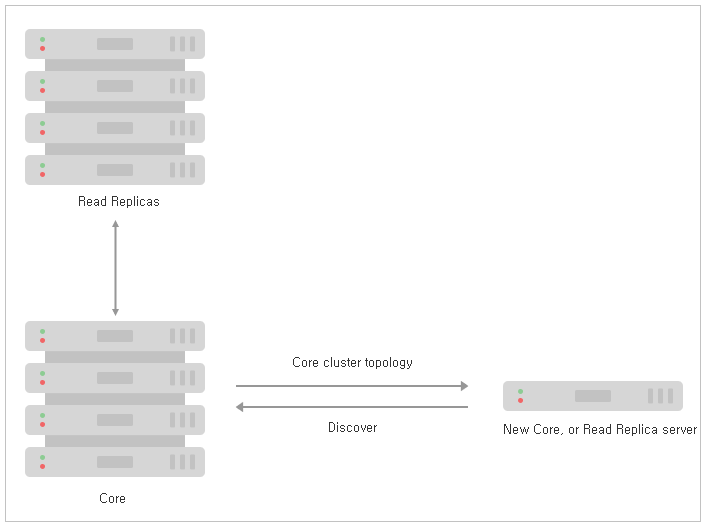

### 4.2.2. Causal 클러스터 수명 주기 `Enterprise Edition`
> 이 장에서는 Neo4j Causal 클러스터의 수명 주기에 대해 설명합니다.

[4.2.1 "소개"](./architecture.md)에서는 Causal 클러스터의 개요를 제공했습니다. 이 장에서는 클러스터가 어떻게 작동하는지에 대해 더 깊이 이해할 것입니다. 클러스터 작동 방식에 대한 이해를 높임으로써 우리는 생산 시스템의 설계, 배포 및 문제 해결에 대한 대비를 더 강화하게 될 것입니다.

우리의 심층적인 학습은 클러스터의 수명 주기를 따를 것입니다. 클러스터가 형성되고 처리되면 Core 클러스터를 부팅하고 주요 아키텍처 기반을 확보할 것입니다. 그런 다음 Read Replica를 추가하여 그들이 클러스터에 어떻게 부트스트랩으로 결합하는지를 보여주고 그 후 Core Server에 대해 추적을 수행하며 이를 계속 유지할 것입니다. 그러면 우리는 Read Replica 및 Core Server를 종료하기 전에 라이브 클러스터 환경에서 백업이 사용되는 방식을 볼 수 있습니다.

#### 4.2.2.1. discovery 프로토콜
discovery 프로토콜은 Causal 클러스터를 형성하는 첫 번째 단계입니다. 기존 코어 클러스터 서버에 대한 몇가지 힌트를 얻고 이러한 힌트를 사용하여 네트워크 가입 프로토콜을 시작합니다.

**그림 4.6. Causal 클러스터 discovery 프로토콜: Core-to-Core 또는 Read replica-to-Core 전용**

이러한 힌트로부터 서버는 기존 클러스터에 참여하거나 자체 클러스터 중 하나를 형성할 것입니다.(분할된 브레인 클러스터를 형성하는 것에 대해 걱정하지 마십시오. 코어 클러스터 형성은 Raft 프로토콜에 기반을 두고 있으므로 안전합니다).

>> discovery 프로토콜은 그것이 코어 서버인지 검색을 수행하는 Read replica인지에 관계없이 오직 코어 서버만을 대상으로 합니다. 이는 Read Replica가 수없이 많으며 상대적으로 말하자면 일시적인 반면에 코어 서버는 시간이 지남에 따라 더 적고 상대적으로 안정적일 것으로 예상하기 때문입니다.

힌트는 일반적으로 점으로 구분 된 10 진수 IP 주소 및 보급 된 포트로써, [*neo4j.conf*](/configuration.html)의 [`causal_clustering.initial_discovery_members`](https://neo4j.com/docs/operations-manual/3.3/reference/configuration-settings/#config_causal_clustering.initial_discovery_members)로 제공됩니다.

#### 4.2.2.6 backup 프로토콜
During the lifetime of the Causal Cluster, operators will want to back up the cluster state for disaster recovery purposes. Backup is a strategy that places a deliberate gap between the online system and its recent state such that the two do not share common failure points (such as the same cloud storage). Backup is in addition to and orthogonal to any strategies for spreading Core Servers and Read Replicas across data centers.


For operational details on how to backup a Neo4j cluster, see Section 4.2.5, “Backup planning for a Causal Cluster”.
