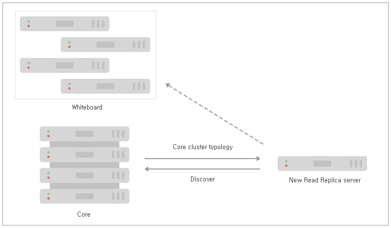

### 4.2.2. Causal 클러스터 수명 주기 `Enterprise Edition`
> 이 장에서는 Neo4j Causal 클러스터의 수명 주기에 대해 설명합니다.

[4.2.1 "소개"](./architecture.md)에서는 Causal 클러스터의 개요를 제공했습니다. 이 장에서는 클러스터가 어떻게 작동하는지에 대해 더 깊이 이해할 것입니다. 클러스터 작동 방식에 대한 이해를 높임으로써 우리는 생산 시스템의 설계, 배포 및 문제 해결에 대한 대비를 더 강화하게 될 것입니다.

우리의 심층적인 학습은 클러스터의 수명 주기를 따를 것입니다. 클러스터가 형성되고 처리되면 코어 클러스터를 부팅하고 주요 아키텍처 기반을 확보할 것입니다. 그런 다음 Read Replica를 추가하여 그들이 클러스터에 어떻게 부트스트랩으로 결합하는지를 보여주고 그 후 코어 서버에 대해 추적을 수행하며 이를 계속 유지할 것입니다. 그러면 우리는 Read Replica 및 코어 서버를 종료하기 전에 라이브 클러스터 환경에서 백업이 사용되는 방식을 볼 수 있습니다.

#### 4.2.2.1. discovery 프로토콜
discovery 프로토콜은 Causal 클러스터를 형성하는 첫 번째 단계입니다. 기존 코어 클러스터 서버에 대한 몇가지 힌트를 얻고 이러한 힌트를 사용하여 네트워크 가입 프로토콜을 시작합니다.

**그림 4.6. Causal 클러스터 discovery 프로토콜: Core-to-Core 또는 Read replica-to-Core 전용**

이러한 힌트로부터 서버는 기존 클러스터에 참여하거나 자체 클러스터 중 하나를 형성할 것입니다.(분할된 브레인 클러스터를 형성하는 것에 대해 걱정하지 마십시오. 코어 클러스터 형성은 Raft 프로토콜에 기반을 두고 있으므로 안전합니다).

>> discovery 프로토콜은 그것이 코어 서버인지 검색을 수행하는 Read replica인지에 관계없이 오직 코어 서버만을 대상으로 합니다. 이는 Read Replica가 수없이 많으며 상대적으로 말하자면 일시적인 반면에 코어 서버는 시간이 지남에 따라 더 적고 상대적으로 안정적일 것으로 예상하기 때문입니다.

힌트는 일반적으로 점으로 구분 된 10 진수 IP 주소 및 보급 된 포트로써, [*neo4j.conf*](/configuration.html)의 [`causal_clustering.initial_discovery_members`](https://neo4j.com/docs/operations-manual/3.3/reference/configuration-settings/#config_causal_clustering.initial_discovery_members)로 제공됩니다. 이 힌트를 사용하면 서버는 나열된 다른 서버와 핸드 셰이크를 시도합니다. 다른 서버 또는 서버들과의 핸드 셰이크에 성공하면 현재 서버는 현재의 모든 토폴로지를 발견할 것입니다.
discovery 서비스는 Causal 클러스터의 수명 기간 동안 계속 실행되며 사용 가능한 서버의 현재 상태를 유지하고 클라이언트가 클라이언트 측 [드라이버](https://neo4j.com/docs/developer-manual/3.4-preview/drivers/)를 통해 적절한 서버에 쿼리를 라우팅할 수 있도록 하는데 사용됩니다.

#### 4.2.2.2. 코어 멤버십
만일 그것이 탐색을 수행하는 코어 서버라면, 기존 코어 서버 중 하나에 연결하면 그것은 Raft 프로토콜에 참가합니다.

>> Raft는 2014년 박사 학위 논문을 위해 Diego Ongaro에 의해 설계된 여러 비공유 서버에서 일관된 로그를 유지하기 위한 분산 알고리즘입니다. 자세한 내용은 [Raft 논문](https://ramcloud.stanford.edu/~ongaro/thesis.pdf)을 참조하십시오.

Raft는 분산된 로그를 동기화 상태로 유지하는 데 있어 정상적인 역할을 함으로써 클러스터 멤버십을 처리합니다. 클러스터에 가입하려면 클러스터 멤버십 항목을 Raft 로그에 삽입 한 다음 기존 클러스터에서 안정적으로 복제해야 합니다. 해당 항목이 Raft 합의 그룹(알고리즘의 특정 인스턴스를 실행하는 시스템)의 충분한 멤버에게 적용되면, 그들은 새 서버를 포함하도록 그들의 클러스터 뷰를 업데이트합니다. 따라서 멤버십 변경은 Raft를 통해 거래된 다른 데이터와 동일한 안전성에서 이득을 얻습니다(상세 정보는 [4.2.2.4장, "Raft 프로토콜을 통한 전송"](#4224-raft-프로토콜을-통한-전송)을 참조).

또한 새로운 코어 서버는 내부 Raft 인스턴스를 초기화 할 때 다른 코어 서버와 관련된 자체 raft 로그를 따라가야 합니다. 이것은 클러스터가 처음 부팅되어 거의 수행되지 않은 정상적인 경우입니다. 다른 서버의 그래프 데이터를 따라 잡을 필요가 있는 경우 ([4.2.2.5장. "Catchup 프로토콜"](#4225-catchup-프로토콜)에 따라) 새로운 코어 서버를 사용할 수 있게 되기까지 지연이 있을 것입니다. 이것은 서버가 많은 양의 그래프 데이터를 보유하고 있는 수명이 긴 클러스터의 일반적인 경우입니다.

>> 인스턴스가 다른 인스턴스에 대한 연결을 설정하면, 인스턴스는 클러스터의 현재 상태를 판별하고 클러스터에 참여할 수 있는지 확인합니다. 적격하려면 Neo4j 인스턴스가 클러스터의 다른 멤버들과 동일한 데이터베이스 저장소를 호스팅해야 하거나 (더 오래 되고 낡은 상태로 허용되긴 하지만), 또는 데이터베이스 저장소가 없는 새로운 배포이어야 합니다.

#### 4.2.2.3. Read replica 멤버십
Read replica가 탐색을 수행할 때, 그것이 사용 가능한 코어 클러스터의 어느 것에 연결되면 공유된 화이트보드에 자신을 추가합니다.

그림 4.7. 공유 화이트보드에 등록 된 모든 Read replica.

이 화이트보드는 모든 살아있는 Read Replica의 뷰를 제공하며 최종 사용자 애플리케이션을 지원하는 데이터베이스 드라이버의 요청 라우팅과 클러스터 상태 모니터링을 위해 사용됩니다.

>> Read Replica는 Raft 프로토콜과 관련이 없으며, 클러스터 토폴로지에도 영향을 미치지 않습니다. 따라서 Raft 외부에서 공유된 화이트보드는 편안하게 매우 많은 수의 Read Replica로 확장됩니다.

화이트보드는 정상적으로 탈퇴하지않고 갑자기 실패하는 경우에도, Read Replica가 클러스터에 참가 및 탈퇴 할 때 최신 상태로 유지됩니다.

#### 4.2.2.4. Raft 프로토콜을 통한 전송
일단 부트스트랩되면 각 코어 서버는 데이터베이스 트랜잭션을 처리하는 데 시간을 소비합니다. 업데이트는 Raft 프로토콜을 통해 코어 서버를 중심으로 안정적으로 복제됩니다. 업데이트는 이후에 그래프 모델에 적용되는 트랜잭션 명령을 포함하는 (커밋된) Raft 로그 항목의 형태로 나타납니다.

>> Raft의 주요 설계 목표 중 하나는 구현 시 까다로운 버그를 숨길 수 있는 장소가 더 적도록 쉽게 이해할 수 있도록 하는 것이다. 부작용으로 데이터베이스 운영자가 자신의 Causal 클러스터에서 코어 서버를 쉽게 추론 할 수도 있습니다.

현재 용어(논리 시계)에 대한 Raft Leader는 로컬 로그의 헤드에 트랜잭션 (Raft 용어로 '엔트리')을 추가하고 다른 인스턴스에 동일한 작업을 수행하도록 요청합니다.

#### 4.2.2.6. backup 프로토콜
During the lifetime of the Causal Cluster, operators will want to back up the cluster state for disaster recovery purposes. Backup is a strategy that places a deliberate gap between the online system and its recent state such that the two do not share common failure points (such as the same cloud storage). Backup is in addition to and orthogonal to any strategies for spreading Core Servers and Read Replicas across data centers.


For operational details on how to backup a Neo4j cluster, see Section 4.2.5, “Backup planning for a Causal Cluster”.
