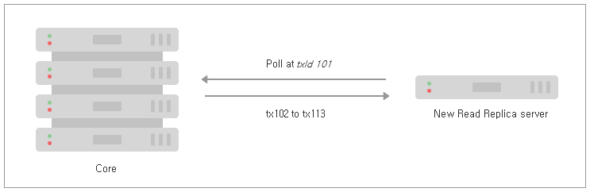

### 4.2.2. Causal 클러스터 수명 주기 `Enterprise Edition`
> 이 장에서는 Neo4j Causal 클러스터의 수명 주기에 대해 설명합니다.

[4.2.1 "소개"](./architecture.md)에서는 Causal 클러스터의 개요를 제공했습니다. 이 장에서는 클러스터가 어떻게 작동하는지에 대해 더 깊이 이해할 것입니다. 클러스터 작동 방식에 대한 이해를 높임으로써 우리는 생산 시스템의 설계, 배포 및 문제 해결에 대한 대비를 더 강화하게 될 것입니다.

우리의 심층적인 학습은 클러스터의 수명 주기를 따를 것입니다. 클러스터가 형성되고 처리되면 코어 클러스터를 부팅하고 주요 아키텍처 기반을 확보할 것입니다. 그런 다음 Read Replica를 추가하여 그들이 클러스터에 어떻게 부트스트랩으로 결합하는지를 보여주고 그 후 코어 서버에 대해 추적을 수행하며 이를 계속 유지할 것입니다. 그러면 우리는 Read Replica 및 코어 서버를 종료하기 전에 라이브 클러스터 환경에서 백업이 사용되는 방식을 볼 수 있습니다.

#### 4.2.2.1. discovery 프로토콜
discovery 프로토콜은 Causal 클러스터를 형성하는 첫 번째 단계입니다. 기존 코어 클러스터 서버에 대한 몇가지 힌트를 얻고 이러한 힌트를 사용하여 네트워크 가입 프로토콜을 시작합니다.

**그림 4.6. Causal 클러스터 discovery 프로토콜: Core-to-Core 또는 Read replica-to-Core 전용**

이러한 힌트로부터 서버는 기존 클러스터에 참여하거나 자체 클러스터 중 하나를 형성할 것입니다.(분할된 브레인 클러스터를 형성하는 것에 대해 걱정하지 마십시오. 코어 클러스터 형성은 Raft 프로토콜에 기반을 두고 있으므로 안전합니다).

>> discovery 프로토콜은 그것이 코어 서버인지 검색을 수행하는 Read replica인지에 관계없이 오직 코어 서버만을 대상으로 합니다. 이는 Read Replica가 수없이 많으며 상대적으로 말하자면 일시적인 반면에 코어 서버는 시간이 지남에 따라 더 적고 상대적으로 안정적일 것으로 예상하기 때문입니다.

힌트는 일반적으로 점으로 구분 된 10 진수 IP 주소 및 보급 된 포트로써, [*neo4j.conf*](/configuration.html)의 [`causal_clustering.initial_discovery_members`](https://neo4j.com/docs/operations-manual/3.3/reference/configuration-settings/#config_causal_clustering.initial_discovery_members)로 제공됩니다. 이 힌트를 사용하면 서버는 나열된 다른 서버와 핸드 셰이크를 시도합니다. 다른 서버 또는 서버들과의 핸드 셰이크에 성공하면 현재 서버는 현재의 모든 토폴로지를 발견할 것입니다.
discovery 서비스는 Causal 클러스터의 수명 기간 동안 계속 실행되며 사용 가능한 서버의 현재 상태를 유지하고 클라이언트가 클라이언트 측 [드라이버](https://neo4j.com/docs/developer-manual/3.4-preview/drivers/)를 통해 적절한 서버에 쿼리를 라우팅할 수 있도록 하는데 사용됩니다.

#### 4.2.2.2. 코어 멤버십
만일 그것이 탐색을 수행하는 코어 서버라면, 기존 코어 서버 중 하나에 연결하면 그것은 Raft 프로토콜에 참가합니다.

>> Raft는 2014년 박사 학위 논문을 위해 Diego Ongaro에 의해 설계된 여러 비공유 서버에서 일관된 로그를 유지하기 위한 분산 알고리즘입니다. 자세한 내용은 [Raft 논문](https://ramcloud.stanford.edu/~ongaro/thesis.pdf)을 참조하십시오.

Raft는 분산된 로그를 동기화 상태로 유지하는 데 있어 정상적인 역할을 함으로써 클러스터 멤버십을 처리합니다. 클러스터에 가입하려면 클러스터 멤버십 항목을 Raft 로그에 삽입 한 다음 기존 클러스터에서 안정적으로 복제해야 합니다. 해당 항목이 Raft 합의 그룹(알고리즘의 특정 인스턴스를 실행하는 시스템)의 충분한 멤버에게 적용되면, 그들은 새 서버를 포함하도록 그들의 클러스터 뷰를 업데이트합니다. 따라서 멤버십 변경은 Raft를 통해 거래된 다른 데이터와 동일한 안전성에서 이득을 얻습니다(상세 정보는 [4.2.2.4장, "Raft 프로토콜을 통한 전송"](#4224-raft-프로토콜을-통한-전송)을 참조).

또한 새로운 코어 서버는 내부 Raft 인스턴스를 초기화 할 때 다른 코어 서버와 관련된 자체 raft 로그를 따라가야 합니다. 이것은 클러스터가 처음 부팅되어 거의 수행되지 않은 정상적인 경우입니다. 다른 서버의 그래프 데이터를 따라 잡을 필요가 있는 경우 ([4.2.2.5장. "Catchup 프로토콜"](#4225-catchup-프로토콜)에 따라) 새로운 코어 서버를 사용할 수 있게 되기까지 지연이 있을 것입니다. 이것은 서버가 많은 양의 그래프 데이터를 보유하고 있는 수명이 긴 클러스터의 일반적인 경우입니다.

>> 인스턴스가 다른 인스턴스에 대한 연결을 설정하면, 인스턴스는 클러스터의 현재 상태를 판별하고 클러스터에 참여할 수 있는지 확인합니다. 적격하려면 Neo4j 인스턴스가 클러스터의 다른 멤버들과 동일한 데이터베이스 저장소를 호스팅해야 하거나 (더 오래 되고 낡은 상태로 허용되긴 하지만), 또는 데이터베이스 저장소가 없는 새로운 배포이어야 합니다.

#### 4.2.2.3. Read replica 멤버십
Read replica가 탐색을 수행할 때, 그것이 사용 가능한 코어 클러스터의 어느 것에 연결되면 공유된 화이트보드에 자신을 추가합니다.

그림 4.7. 공유 화이트보드에 등록 된 모든 Read replica.

이 화이트보드는 모든 살아있는 Read Replica의 뷰를 제공하며 최종 사용자 애플리케이션을 지원하는 데이터베이스 드라이버의 요청 라우팅과 클러스터 상태 모니터링을 위해 사용됩니다.

>> Read Replica는 Raft 프로토콜과 관련이 없으며, 클러스터 토폴로지에도 영향을 미치지 않습니다. 따라서 Raft 외부에서 공유된 화이트보드는 편안하게 매우 많은 수의 Read Replica로 확장됩니다.

화이트보드는 정상적으로 탈퇴하지않고 갑자기 실패하는 경우에도, Read Replica가 클러스터에 참가 및 탈퇴 할 때 최신 상태로 유지됩니다.

#### 4.2.2.4. Raft 프로토콜을 통한 전송
일단 부트스트랩되면 각 코어 서버는 데이터베이스 트랜잭션을 처리하는 데 시간을 소비합니다. 업데이트는 Raft 프로토콜을 통해 코어 서버를 중심으로 안정적으로 복제됩니다. 업데이트는 이후에 그래프 모델에 적용되는 트랜잭션 명령을 포함하는 (커밋된) Raft 로그 항목의 형태로 나타납니다.

>> Raft의 주요 설계 목표 중 하나는 구현 시 까다로운 버그를 숨길 수 있는 장소가 더 적도록 쉽게 이해할 수 있도록 하는 것이다. 부작용으로 데이터베이스 운영자가 자신의 Causal 클러스터에서 코어 서버를 쉽게 추론 할 수도 있습니다.

현재 용어(논리 시계)에 대한 Raft 리더는 로컬 로그의 헤드에 트랜잭션 (Raft 용어로 '엔트리')을 추가하고 다른 인스턴스에 동일한 작업을 수행하도록 요청합니다. 리더가 대다수 인스턴스가 항목을 추가 한 것을 볼 수 있을 때, 그것은 Raft 로그에 커밋된 것으로 간주될 수 있습니다. 어떠한 (병적이지 않은) 결함도 허용하기에 충분한 중복성이 시스템에 있으므로 이제 트랜잭션이 안전하게 커밋되었음을 클라이언트 애플리케이션에 알릴 수 있습니다.

>> Raft 프로토콜은 인스턴스가 수행할 수 있는 세가지 역할을 설명합니다: *리더, 추종자* 및 *후보자* 이들은 일시적인 역할이며 모든 코어 서버는 클러스터의 전체 수명 내내 이러한 역할을 수행할 것으로 기대할 수 있습니다. 컴퓨팅 과학의 관점에서 볼 때 이러한 상태를 이해하는 것은 흥미롭지만, 운영자는 그들이 구현 세부 사항이라고 지나치게 우려해서는 안 됩니다.

안전성을 위해, 어떤 Raft 프로토콜 인스턴스 내에서 주어진 기간 동안 진행할 수 있는 리더는 단 한 명뿐입니다. 리더는 Raft 로그 항목에 명령을 부과하고 *추종자*에 관하여 로그 전달을 수행할 책임이 있습니다.

추종자는 현재 리더의 로그에 관하여 그들의 로그를 유지합니다. 클러스터의 어떤 참가자라도 리더가 실패했다고 의심되면 그들이 *후보자* 상태가 되어 리더십 선거를 추진할 수 있습니다. Neo4j 코어 서버에서 이것은 ms 시간범위에서 발생합니다. 기본값은 약 500ms입니다.

가장 좋은 상태에 있는 어느 인스턴스(사용가능하다면 기존 리더도 포함)든지 선거에서 리더로 당선될 수 있습니다. 리더의 "최상의 상태"는 가장 높은 기간에 의해 결정되고, 가장 긴 로그에 의해 결정된 다음, 가장 높은 커밋된 항목에 의해 결정됩니다.

데이터 손실없이 역할을 장애 조치하는 기능은 장애가 발생한 경우에도 계속 진행할 수 있게 합니다. Raft 인스턴스가 실패하더라도, 프로토콜은 **데이터 손실없이** 실패한 인스턴스(또는 인스턴스들)를 인계받기 위해 남은 인스턴스 중 가장 적합한 인스턴스를 빠르게 결합할 수 있습니다. 이것은 Neo4j Causal 클러스터링이 애플리케이션에 지속적으로 가용성을 제공할 수 있게 해주는 *논 블로킹* 컨센서스 프로토콜의 핵심입니다.

#### 4.2.2.5. Catchup 프로토콜
Read Replica는 그래프 쿼리를 동시에 처리하고 코어 서버의 트랜잭션 스트림을 적용하여 로컬 그래프 저장소를 업데이트하는 데 시간을 소비합니다.

그림 4.8. 코어에서 Read replica로 전송된 트랜잭션

코어 서버에서 Read Replica로의 업데이트는 트랜잭션 운송에 의해 전파됩니다. 트랜잭션 전송은 Read Replica가 수신하고 처리한 마지막 트랜잭션의 ID를 지정하여 코어 서버를 빈번하게 *폴링*함으로써 유발됩니다. 폴링의 빈도는 운영상의 선택입니다.

>> Neo4j 트랜잭션 ID는 엄격하게 단조로운 정수 값입니다 (항상 증가합니다). 이렇게하면 마지막으로 처리된 트랜잭션 ID를 코어 서버의 트랜잭션 ID와 비교하여 트랜잭션이 Read Replica에 적용되었는지 여부를 쉽게 판별할 수 있습니다.

 Read Replica의 트랜잭션 기록과 코어 서버의 트랜잭션 기록 간에 큰 차이가 있다면, 폴링을 수행해도 트랜잭션이 전송되지 않을 수 있습니다. 예를 들어 새로운  Read replica가 장기 실행 클러스터에 도입되거나 Read replica가 상당한 기간 동안 중단된 경우와 같이 이는 매우 예상되는 현상입니다. 이러한 경우 catchup 프로토콜은 코어 서버와 Read replica 간의 간격이 트랜잭션 전달을 통해 채우기에 너무 크다는 것을 깨닫고, 코어 서버에서 직접 Read replica로 데이터베이스 저장소를 복사하도록 변합니다. 우리는 라이브 시스템으로 작업하고 있기 때문에, 데이터베이스 저장소 복사본의 끝에서 코어 서버의 데이터베이스가 변경될 가능성이 있습니다. Read replica는 사용 가능하게 되기 전에 복사 작업 동안 누락 된 트랜잭션을 요청하는 것으로 catchup을 완료합니다.

>> 매우 느린 데이터베이스 저장소 복사본은 코어 서버가 상당히 이동하면서 트랜잭션 로그 전달을 통해 따라잡기에는 Read replica를 너무 뒤에 남겨 둘 수 있습니다. 이 경우 Read replica 서버는 catchup 프로토콜을 반복합니다. 병리학적인 경우에 운영자는 빠른 백업으로부터 최근 저장 파일의 스냅 샷, 복원 또는 파일 복사에 개입할 수 있습니다.

#### 4.2.2.6. backup 프로토콜
 Causal 클러스터의 수명 기간 동안 운영자는 재해 복구를 위해 클러스터 상태를 백업하길 원할 것입니다. 백업은 온라인 시스템과 최근 상태 사이에 고의적인 차이를 두어 공통 실패 지점 (예 : 동일한 클라우드 저장소)을 공유하지 않도록 하는 전략입니다. 백업은 데이터 센터 전반에 걸쳐 코어 서버 및 Read Replica를 배포하기 위한 모든 전략에 추가되며 직교합니다.

>> Neo4j 클러스터를 백업하는 방법에 대한 자세한 내용은 [4.2.5장. "인과 클러스터 백업 계획"](./backup-planning-for-a-causal-cluster.md)에서 참조하십시오.

Backup 프로토콜은 사실상 Catchup 프로토콜의 인스턴스로서 구현됩니다. 클라이언트가 Read replica가 되는 대신에 실시간 데이터베이스가 아닌 디스크에 데이터를 스풀링하는 사실상 `neo4j-admin backup` 툴입니다.

`neo4j-admin backup`을 통해 전체 및 증분 백업을 수행할 수 있으며 코어 서버와 Read Replica 모두 지원 백업을 수행할 수 있습니다. 그러나 Read Replica가 상대적으로 많으면, 더 적은 수의 코어 서버가 아닌 이들 중 하나를 백업의 대상으로 지정하는 것이 일반적입니다 (코어 대 Read replica 백업에 대한 더 자세한 내용은 [4.2.5장, "Causal 클러스터 백업 계획"](./backup-planning-for-a-causal-cluster.md) 참조) .

#### 4.2.2.7. Read replica
클린 종료시, Read replica는 discovery 프로토콜을 호출하여 클러스터의 공유된 화이트 보드 개요에서 그 자신을 제거합니다. 또한 데이터베이스가 완전히 종료되고, 일관성이 있으며, 즉시 이후에 사용할 수 있도록 준비되었는지도 확인합니다.

정전과 같은 언클린 종료시, 클러스터의 개요를 유지하는 코어 서버는 Read replica의 연결이 갑자기 끊겼음을 알게될 것입니다. discovery 장치는 처음에는 Read replica의 화이트 보드 항목을 숨기고, Read replica가 신속히 다시 나타나지 않으면 공유된 화이트 보드에서 적당한 메모리 사용이 재확보됩니다.

언클린 종료시, Read replica는 완전히 일관된 저장소 파일이나 트랜잭션 로그를 가지지 않을 수 있습니다. 후속 재부팅시 Read replica는 부분적으로 적용된 트랜잭션을 롤백하여 데이터베이스가 일관된 상태가 되도록 합니다.

#### 4.2.2.8. 코어 종료
코어 서버 부팅과 같이 클린 코어 서버 종료는 Raft 프로토콜을 통해 처리됩니다. 코어 서버가 종료될 때, 그것은 코어 서버 주위에 복제되는 Raft 로그에 구성원 항목을 추가합니다. 코어 서버의 대다수가 그 구성원 항목을 커밋하면 leaver는 논리적으로 클러스터를 벗어나 안전하게 종료할 수 있습니다. 남아있는 모든 인스턴스는 클러스터가 더 작아진 것을 수용하므로 내결함성이 떨어집니다. 만약 그 Leaver가 떠나는 시점에 리더 역할을 하고 있었다면, 그것은 간결한 선거 후에 또 다른 코어 서버로 전환될 것입니다.

언클린 종료는 코어 서버가 남아 있다는 것을 클러스터에 직접 알려주지 않습니다. 대신에 코어 클러스터 크기는 커밋을 위한 계산 대부분을 위해 동일하게 유지됩니다. 따라서 5 개의 코어 서버 클러스터에서 언클린 종료가 발생하면, 이제 언클린 종료 전 3/5보다 더 엄격한 마진인 3/4 멤버가 커밋에 동의해야 합니다.

>> 물론 코어 서버에 장애가 발생하는 경우 운영자 또는 모니터링 스크립트는 경고가 표시되어 필요한 경우 클러스터에 개입할 수 있습니다.

만약 leaver가 리더 역할을 하는 중이었다면, 새로운 리더를 만들기 위한 간단한 선거가 있을 것입니다. 새로운 리더가 선출되면 코어 클러스터는 비록 중복성이 더 적지만 계속됩니다. 그러나 이 실패에도 불구하고, 5개 서버에서 4개로 축소된 코어 클러스터는 여전히 읽기 전용으로 되기 전에 한번 더 장애를 허용할 수 있습니다.
