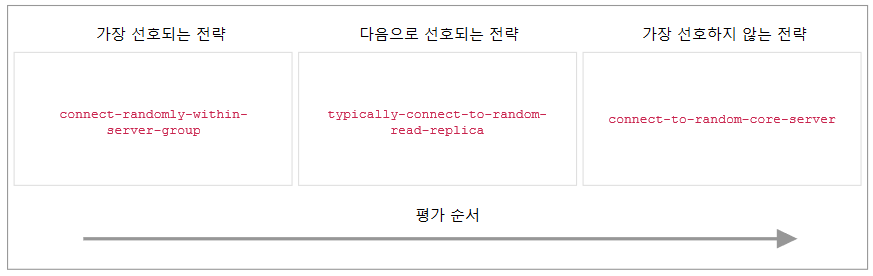
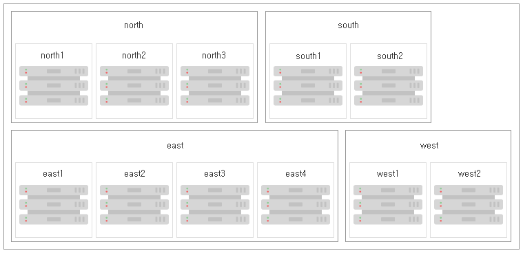

### 4.2.9. 다중 데이터 센터 운영 구성 `Enterprise Edition`
> 이 장에서는 Neo4j 서버가 토폴로지/데이터 센터를 인식하도록 구성하는 방법을 보여줍니다. 이것은 확장 가능한 다중 데이터 센터 배포를 달성하는 데 필요한 정확한 구성을 설명합니다.

>> **다중 데이터 센터 운영 활성화**
>>
>> 다중 데이터 센터 기능은 별도로 라이센스가 부여되며 구체적으로 활성화해야 합니다. 자세한 내용은 ["다중 데이터 센터 운영을 위한 라이센스" 장](../multi-data-center.md#다중-데이터-센터-운영을-위한-라이센스)을 참조하십시오.

#### 4.2.9.1. 다중 데이터 센터 운영 활성화
다른 작업을 수행하기에 앞서, 우리는 다중 데이터 센터 기능을 활성화해야 합니다. 이는 ["다중 데이터 센터 운영을 위한 라이센스" 장](../multi-data-center.md#다중-데이터-센터-운영을-위한-라이센스)에서 설명합니다.

#### 4.2.9.2. 서버 그룹
우리의 특정 요구 사항에 따라 Causal 클러스터 서버의 사용을 최적화하기 위해 우리는 그들을 *서버 그룹*으로 정렬합니다. 서버 그룹 멤버십은 운영자 도메인의 데이터 센터, 가용 영역 또는 기타 중요한 토폴로지 요소에 매핑 할 수 있습니다. 서버 그룹은 또한 겹쳐질 수도 있습니다.

서버 그룹은 Causal 클러스터의 서버 세트에 매핑되는 키로 정의됩니다. 서버 그룹 멤버십은 *neo4j.conf*의 [`causal_clustering.server_groups`](https://neo4j.com/docs/operations-manual/3.4/reference/configuration-settings/#config_causal_clustering.server_groups) 매개 변수를 사용하여 각 서버에 정의됩니다. Causal 클러스터의 각 서버는 0개 또는 여러 개의 서버 그룹에 속할 수 있습니다.

##### 예제 4.12. 서버 그룹 멤버십 정의
-----------------------------
서버 그룹의 멤버십은 다음 예제와 같이 *neo4j.conf*에서 설정할 수 있습니다:

`````````````````
# Add the current instance to the groups `us` and `us-east`
causal_clustering.server_groups=us,us-east
`````````````````
````````````````
# Add the current instance into the group `london`
causal_clustering.server_groups=london
````````````````
````````````````
# Add the current instance into the group `eu`
causal_clustering.server_groups=eu
```````````````````

각 서버 그룹의 멤버십은 명시적이어야 합니다. 예를 들어, `gb-london` 그룹의 서버는 그 서버가 명시적으로 해당 그룹에 추가되지 않는 한 자동적으로 일부 `gb` 또는 `eu` 그룹의 일부가 아닙니다. 즉, 그룹 간의 (암시적인) 모든 관계는 해당 그룹이 업스트림 시스템에서 데이터를 요청하기 위한 기초로 사용될 때만 구체화됩니다.

-----------------------

서버 그룹은 필수는 아니지만, 존재하지 않으면 서버에 대한 특정 업스트림 트랜잭션 종속성을 설정할 수 없습니다. 지정된 서버 그룹이 없는 경우, 클러스터는 기본적으로 가장 비관적인 대체 동작을 수행합니다: 각 Read Replica는 임의의 코어 서버로부터 작동할 것입니다.

#### 4.2.9.3. 전략 플러그인
*전략 플러그인*은 트랜잭션 로그를 동기화하기 위해 클러스터의 Read Replica가 서버에 접속하는 방법을 정의하는 일련의 규칙입니다. Neo4j는 사전 정의된 전략 세트와 함께 제공되며, 설계 특정 언어, DSL을 제공하여 사용자 정의 전략을 유연하게 생성할 수 있습니다. 마지막으로, Neo4j는 고급 사용자가 업스트림 권장 사항을 향상시키는 데 사용할 수있는 API를 지원합니다.

일단 전략 플러그인이 만족스러운 업스트림 서버를 확인하면 트랜잭션을 가져 와서 로컬 Read Replica를 업데이트하여 단일 동기화를 수행하는 데 사용됩니다. 이후 업데이트의 경우, 이 절차가 반복되어 항상 가장 선호되는 사용 가능한 업스트림 서버가 확인됩니다.

#### 사전 정의된 전략을 사용하여 업스트림 선택 전략 구성하기
Neo4j에는 다음과 같은 사전 정의된 전략 플러그인이 포함되어 있습니다:

| 플러그인 이름 | 결과 동작 |
|--------------|----------|
|`connect-to-random-core-server`|현재 사용 가능한 것들 중에서 임의로 선택하여 **코어 서버**에 연결.|
|`typically-connect-to-random-read-replica`|사용 가능한 **Read Replica**에 연결하나, 시간의 약 10%는 임이의 코어 서버에 연결.|
|`connect-randomly-within-server-group`|`causal_clustering.server_groups`에 지정된 서버 그룹에서 사용 가능한 아무 인스턴스(코어 서버 *및* Read Replica)에 임의로 연결.|

사전 정의된 전략은 [`causal_clustering.upstream_selection_strategy`](https://neo4j.com/docs/operations-manual/3.4/reference/configuration-settings/#config_causal_clustering.upstream_selection_strategy) 옵션을 구성하여 사용됩니다. 이렇게 함으로써 우리는 트랜잭션 데이터의 업스트림 제공자를 확인하기 위한 전략의 순서 선호도를 지정할 수 있습니다. 우리는 목록의 앞부분에 선호하는 전략과 함께 쉼표로 구분된 전략 플러그인 이름의 목록을 제공합니다. 업스트림 전략은 목록 순서의 각 전략에 트랜잭션을 추출할 수 있는 업스트림 서버를 제공할 수 있는지 여부를 질문하여 선택되어 집니다.

##### 예제 4.13. 업스트림 선택 전략 정의
-------------------------------------------
다음 구성 예제를 고려하십시오:

````
causal_clustering.upstream_selection_strategy=connect-randomly-within-server-group,typically-connect-to-random-read-replica
````

이 구성을 사용하면 인스턴스는 먼저 `causal_clustering.server_groups`에 지정된 그룹의 다른 인스턴스에 연결을 시도합니다. 해당 그룹에서 라이브 인스턴스를 찾지 못하면 임의의 Read Replica에 연결합니다.

**그림 4.16. 전략에서 첫 번째 만족스러운 응답이 사용됩니다.**
 

 다운 스트림 서버가 업 스트림 장애가 발생한 경우에도 여전히 라이브 데이터에 액세스 할 수 있도록 하기 위해, 모든 인스턴스의 최후의 수단은 항상 임의의 코어 서버에 연결하는 것입니다. 이는 `causal_clustering.upstream_selection_strategy` 구성을 `connect-to-random-core-server`를 사용하여 종료하는 것과 동일합니다.

 ----------------------------------------------

#### 사용자 정의된 전략 구성하기
Neo4j Causal 클러스터는 [클라이언트-클러스터 로드 밸런싱](./load-balancing.md)을 구성하기 위해 소규모 DSL을 지원합니다. 이것은 ["정책 정의" 장](./load-balancing.md#정책-정의)과 ["필터" 장](./load-balancing.md#필터)에서 자세히 설명합니다. 동일한 DSL은 트랜잭션 업데이트를 요청하기 위해 인스턴스가 또다른 인스턴스에 바인딩하는 방법에 대한 선호도를 설명하는 데 사용됩니다.

DSL은 다음과 같이 `user-defined` 전략을 선택하여 사용할 수 있습니다:

```
causal_clustering.upstream_selection_strategy=user-defined
```

사용자 정의 전략이 지정되면, 클러스터에 대해 설정된 서버 그룹을 기반으로 [`causal_clustering.user_defined_upstream_strategy`](https://neo4j.com/docs/operations-manual/3.4/reference/configuration-settings/#config_causal_clustering.user_defined_upstream_strategy) 설정에 구성을 추가할 수 있습니다.

이 기능에 대해 두 가지 예를 들어 설명하겠습니다:

##### 예제 4.14. 사용자 정의 전략 정의하기

---------------------------------------

설명을 위해 4개의 지역을 제안합니다: `north`, `south`, `east` 및 `west`. 그리고 각 지역 내에 `north1`이나 `west2`와 같은 많은 데이터 센터가 있습니다. 우리는 각 데이터 센터가 자체 서버 그룹에 매핑되도록 서버 그룹을 구성합니다. 또한 각 데이터 센터는 다른 데이터 센터와 독립적으로 장애를 일으키고 지역이 구성 데이터 센터의 상위 그룹 역할을 할 수 있다고 가정합니다. 따라서 `north` 지역의 인스턴스는 `causal_clustering.server_groups=north2,north`와 같은 구성을 가질 수 있으며, 아래 다이어그램에서 보여지는 것 처럼 우리의 물리적 토폴로지와 일치하는 두 그룹 안에 놓여집니다.

**그림 4.17. 지역 및 데이터 센터를 서버 그룹에 매핑**

일단 우리가 서버 그룹을 가지게 되면, 우리의 다음 과제는 그들에 기초한 몇가지 업 스트림 선택 규칙을 정의하는 것입니다. 우리의 설계 목적을 위해 `north` 지역 데이터 센터 중 하나의 인스턴스는 가능하다면 데이터 센터 내에서 캐치업을 선호하지만, 그렇지 않은 경우 북부 인스턴스에 의존한다고 가정해 봅시다. 해당 동작을 구성하려면 다음을 추가하십시오:

```
causal_clustering.user_defined_upstream_strategy=groups(north2); groups(north); halt()
```

구성은 왼쪽에서 오른쪽으로 우선 순위가 지정됩니다. `groups()` 연산자는 처리할 서버 그룹을 생성합니다. 이 경우 `north2` 서버 그룹에 서버가 없는 경우에만 `north` 서버 그룹에서 서버를 생성하는 `groups(north)` 규칙으로 진행합니다. 마지막으로 이전 그룹의 어디에서도 서버를 확인할 수 없으면 `halt()`를 통해 규칙 체인을 중지합니다.

`halt()`을 사용하면 규칙 체인이 명시적으로 종료됩니다. 만약 규칙 체인의 끝에 `halt()`를 사용하지 않으면 `all()` 규칙이 암시적으로 추가됩니다. `all()`은 포괄적입니다: 그것은 모든 서버를 제공하므로 사용 가능한 업스트림 서버를 찾을 가능성이 높아집니다. 그러나 `all()`은 무분별하고 그것이 제공하는 서버가 위상적 또는 지리적으로 로컬이라는 것이 보장되지 않아 잠재적으로 동기화 대기 시간이 길어질 수 있습니다.

--------------------------------------

위의 예는 선호도의 간단한 계층 구조를 보여줍니다. 그러나 우리가 그렇게 선택한다면 더 정교해질 수 있습니다. 예를 들어 우리가 처리할 서버 그룹에 조건을 지정할 수 있습니다.


##### 예제 4.15. 조건이 있는 사용자 정의 전략

------------------------
이 예에서 우리는 후속 조치를 취할 위치를 선택하기 전에 클러스터 건강 상태를 대략적으로 검증하고자 합니다. 이를 위해 다음과 같이 `min()` 필터를 사용합니다.

````
causal_clustering.user_defined_upstream_strategy=groups(north2)->min(3), groups(north)->min(3); all();
````

`groups(north2)->min(3)`은 `north2` 서버 그룹에 3개의 사용 가능한 시스템이 있는 경우 해당 서버 그룹에서 따라잡기를 원한다는 것을 나타내며, 우리는 여기서 이것을 양호한 상태의 지표로서 다룹니다. 만일 `north2`가 그 요구 사항을 충족시킬 수 없다면 (충분히 건강하지 않은 경우) `groups(north)->min(3)`에 따라 최소 3개 이상의 시스템을 사용할 수 있는 경우 `north` 지역의 모든 서버를 따라잡으려고 시도합니다. 마지막으로 우리가 충분히 건강한 `north` 지역을 따라잡을 수 없다면, 우리는 `all()`을 사용하여 전체 클러스터로 (명쾌하게) 돌아갈 것입니다.

`min()` 필터는 간단하지만 서버 그룹 상태를 나타내는 합리적인 지표입니다.

-----------------------------

#### Java를 사용하여 업스트림 전략 플러그인 작성하기
Neo4j는 고급 사용자가 로드, 서브넷, 시스템 크기 또는 JVM에서 액세스 할 수 있는 기타 모든 방법으로 업스트림 권장 사항을 향상시키는 데 사용할 수 있는 API를 지원합니다. 이러한 경우 우리는 우리의 필요에 맞게 `org.neo4j.causalclustering.readreplica.UpstreamDatabaseSelectionStrategy`의 자체 이행을 구축하고 사전 패키지 된 플러그인처럼 전략 선택 파이프 라인을 사용하여 그들을 등록하도록 초대됩니다.

우리는 코드에서 `org.neo4j.causalclustering.readreplica.UpstreamDatabaseSelectionStrategy#upstreamDatabase()` 메서드를 재정의해야 합니다. 이 클래스를 재정의하면 다음 항목에 액세스 할 수 있습니다:

| 리소스 | 설명 |
|--------|-----|
|`org.neo4j.causalclustering.discovery.TopologyService`|이것은 클러스터에 있는 모든 서버 및 서버 그룹의 주소에 액세스 할 수 있는 디렉토리 서비스입니다.|
|`org.neo4j.kernel.configuration.Config`|이것은 로컬 인스턴스에 대한 *neo4j.conf*의 구성을 제공합니다. 자체 플러그인에 대한 구성이 여기에 있을 수 있습니다.|
|`org.neo4j.causalclustering.identity.MemberId`|이것은 현재 인스턴스의 고유한 클러스터 `MemberId`를 제공합니다.|

코드 작성 및 테스트가 끝나면 배포 준비를 해야합니다. `UpstreamDatabaseSelectionStrategy` 플러그인은 자바 서비스 로더를 통해 로드됩니다. 즉, 코드를 jar 파일로 패키징 할 때,
