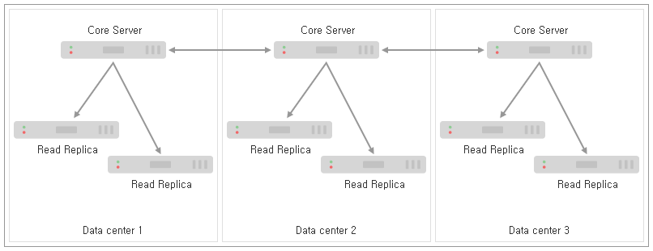

### 4.2.8. 다중 데이터 센터 설계 `Enterprise Edition`
> 이 장에서는 자신의 다중 데이터 생산 환경을 위한 빌딩 블록의 역할을 할 수 있는 다중 데이터 센터 배포를 위한 일반적인 패턴에 대해 설명합니다.

이 장에서는 다중 데이터 센터 환경을 위한 Causal 클러스터를 설계할 때 고려해야 할 여러 고려 사항을 설명하는 일련의 예제를 기반으로 합니다. 우리는 일반적인 다중 데이터 센터 배포 시나리오의 약점과 이점을 이해하게 될 것입니다. 각 시나리오는 명확성을 위해 높은 아키텍처 수준에서 제시됩니다. 다음 장에서는 이러한 배포가 어떻게 구성되는지 더 자세히 설명될 것입니다.

#### 4.2.8.1. 코어 서버 배포 시나리오
각 DC에 동일한 수와 종류의 인스턴스를 배포하는 개념적으로 가장 단순한 다중 데이터 센터 시나리오부터 시작하겠습니다. 이것은 각 데이터 센터가 다른 데이터 센터와 동일하기 때문에 *동종의* 배포입니다.

**예제 4.9. 동종의 3개 데이터 센터 쿠축**
----------------------------
그림 4.9. 각각에 하나의 코어 인스턴스가 있는 세 개의 데이터 센터에서의 동종 배포

위의 다이어그램에서 우리는 3개의 데이터 센터를 가지며, 각각 동일하게 하나의 코어 서버와 적은 수의 Read Replica를 갖추고 있습니다.

Raft는 인스턴스의 대다수가 안전하게 커밋되기 전에 쓰기를 승인하도록 요구하기 때문에, 이 패턴의 커밋 경로 대기 시간에는 가장 빠른 데이터 센터 두 개만 관련됩니다. 따라서 이 설정에 대한 커밋 비용은 다음의 두 WAN 메시지입니다: 트랜잭션을 보내기 위한 것과 ACK 메시지. 장애가 아닌 경우에는 다른 데이터 센터가 크게 지연되지 않을 것이며 트랜잭션도 적용될 것입니다.

각 데이터 센터 내에서 더 많은 코어 인스턴스를 추가하여 시스템 수준의 중복성을 높일 수 있습니다. 예를 들어 각 데이터 센터에 두 대 이상의 시스템을 추가하여 클러스터 또는 단일 데이터 센터 전체에서 최대 4대의 시스템이 자연스럽게 손실되는 것을 허용할 수 있습니다.
