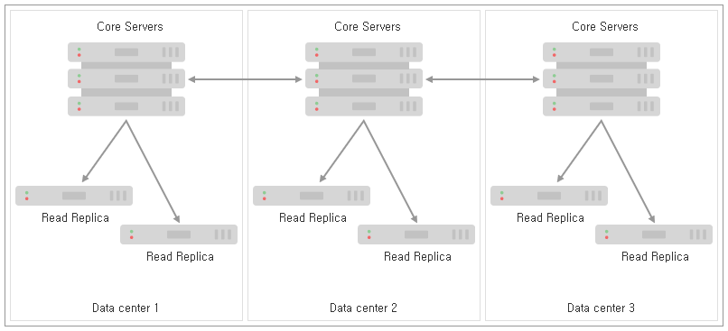
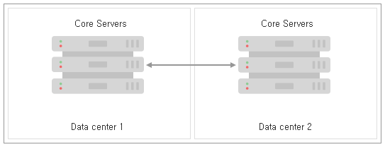
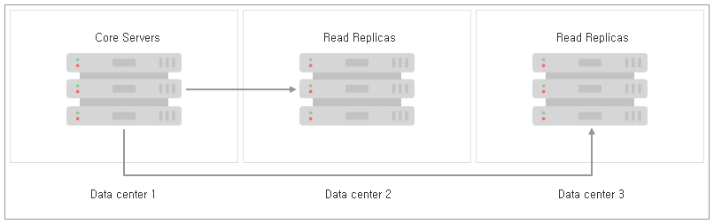
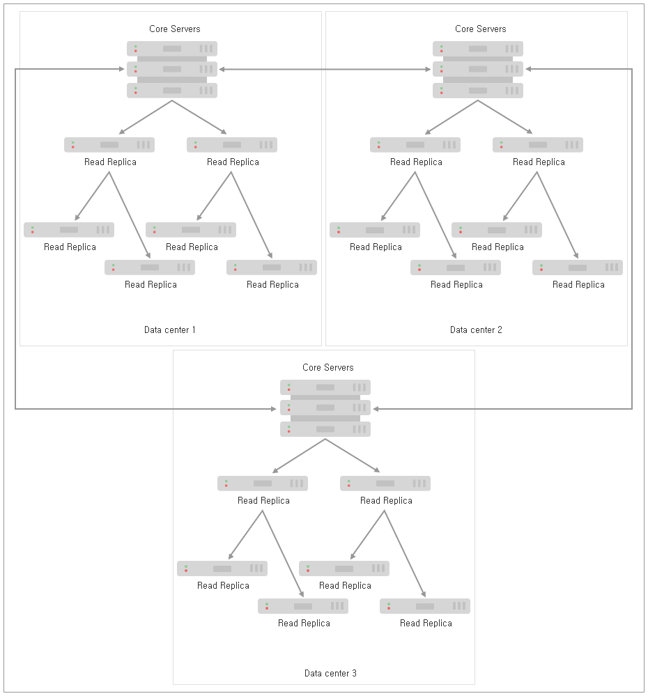
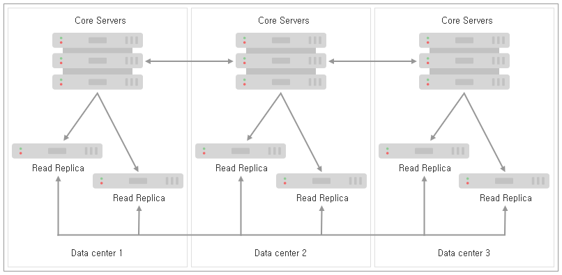
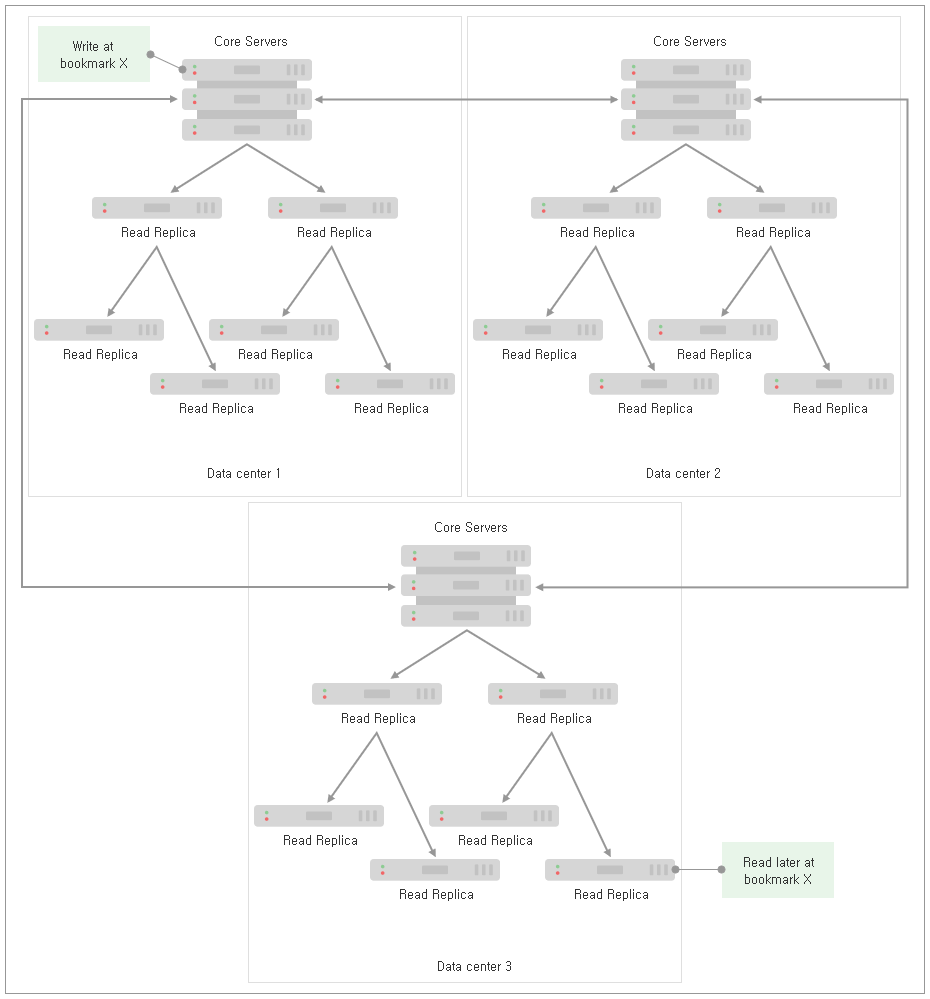

### 4.2.8. 다중 데이터 센터 설계 `Enterprise Edition`
> 이 장에서는 자신의 다중 데이터 생산 환경을 위한 빌딩 블록의 역할을 할 수 있는 다중 데이터 센터 배포를 위한 일반적인 패턴에 대해 설명합니다.

이 장에서는 다중 데이터 센터 환경을 위한 Causal 클러스터를 설계할 때 고려해야 할 여러 고려 사항을 설명하는 일련의 예제를 기반으로 합니다. 우리는 일반적인 다중 데이터 센터 배포 시나리오의 약점과 이점을 이해하게 될 것입니다. 각 시나리오는 명확성을 위해 높은 아키텍처 수준에서 제시됩니다. 다음 장에서는 이러한 배포가 어떻게 구성되는지 더 자세히 설명될 것입니다.

#### 4.2.8.1. 코어 서버 배포 시나리오
각 DC에 동일한 수와 종류의 인스턴스를 배포하는 개념적으로 가장 단순한 다중 데이터 센터 시나리오부터 시작하겠습니다. 이것은 각 데이터 센터가 다른 데이터 센터와 동일하기 때문에 *동종의* 배포입니다.

**예제 4.9. 동종의 3개 데이터 센터 구축**

----------------------------

**그림 4.9. 각각에 하나의 코어 인스턴스가 있는 세 개의 데이터 센터에서의 동종 배포**

위의 다이어그램에서 우리는 3개의 데이터 센터를 가지며, 각각 동일하게 하나의 코어 서버와 적은 수의 Read Replica를 갖추고 있습니다.

Raft는 인스턴스의 대다수가 안전하게 커밋되기 전에 쓰기를 승인하도록 요구하기 때문에, 이 패턴의 커밋 경로 대기 시간에는 가장 빠른 데이터 센터 두 개만 관련됩니다. 따라서 이 설정에 대한 커밋 비용은 다음의 두 WAN 메시지입니다: 트랜잭션을 보내기 위한 것과 ACK 메시지. 장애가 아닌 경우에는 다른 데이터 센터가 크게 지연되지 않을 것이며 트랜잭션도 적용될 것입니다.

각 데이터 센터 내에서 더 많은 코어 인스턴스를 추가하여 시스템 수준의 중복성을 높일 수 있습니다. 예를 들어 각 데이터 센터에 두 대 이상의 시스템을 추가하여 클러스터 또는 단일 데이터 센터 전체에서 최대 4대의 시스템이 자연스럽게 손실되는 것을 허용할 수 있습니다.

**그림 4.10. 각각 세 개의 코어 인스턴스가 있는 세 개의 데이터 센터에 걸치는 동종의 배포**

이 배치 패턴의 장단점을 요약하면 다음과 같습니다:
* 우리는 가용성을 유지하면서 전체 데이터 센터를 잃어버릴 수 있으며, 각 데이터 센터의 시스템 수에 따라 현재 데이터 센터에 관계없이 개별 서버의 손실을 허용 할 수 있습니다.
* 트랜잭션에 대한 커밋 경로가 짧으며, 두 개의 WAN 메시지만 교환됩니다.
* 대다수 데이터 센터의 손실은 [복구해야](./disaster-recovery.md) 하지만, 데이터 센터 중 어느 것이 손실되었는지에 관계없이 운영 절차는 동일합니다.

------------------------------------------------------------------------------------------------------------

[다중 데이터 센터 구성에 대한 장](./configuration.md)에서 볼 수 있듯이, Read Replica는 캐치 대기 시간을 최소화하기 위해 데이터 센터 로컬 코어 서버에서 따라 잡을 수 있도록 편향될 수 있습니다. 또한 데이터 센터 로컬 클라이언트 애플리케이션은 토폴로지 인접성과 확장을 위해 동일한 Read Replica로 라우팅 될 가능성이 높습니다. 더 자세한 내용은 [다중 데이터 센터 로드 밸런싱에 관한 장](./load-balancing.md)을 참조하십시오.

두 데이터 센터의 경우, 첫 번째 본능은 운영 일관성을 위해 사용 가능한 서버의 균형을 맞추는 것입니다. 각각 2개의 코어 인스턴스가 있는 두 데이터 센터에 걸친 동종 배포의 예가 아래 다이어그램에 나와 있습니다:

**예제 4.10. 동종의 두 데이터 센터 배포**

-----------------------------

**그림 4.11. 두 데이터 센터를 걸치는 동종 배포**

이 구성의 문제점은 구조적으로 단순하지만, 대다수 합의에 기반한 Raft 프로토콜의 장점에 맞지 않는다는 것입니다. 장애가 아닌 경우, 대다수의 커밋은 비 로컬 데이터 센터 인스턴스로부터 적어도 하나의 응답을 함축하기 때문에 어떤 트랜잭션을 커밋하기 위해서는 두 개의 WAN 메시지가 발생합니다. 더 나쁜 것은 데이터 센터 중 하나가 손실되면 과반수를 달성하는 것은 불가능하기 때문에 클러스터가 읽기 전용이 된다는 것입니다.

-------------------------------------------------------------------

위의 예에서 볼 수 있듯이, 두 데이터 센터를 통한 동종 배포는 Causal 클러스터링의 장점을 충분히 활용하지 못합니다. 그러나 전체 데이터 센터 손실의 경우, 전체 Raft 로그가 두 데이터 센터 모두에 존재하도록 보장합니다.

데이터 센터를 중심으로 코어 서버를 분산시키는 것과는 달리, 모든 서버는 하나로 호스팅해야 합니다. 이것은 기술 또는 관리상의 이유로 발생할 수 있지만, 어느 쪽이든 쓰기에 대한 LAN 커밋 대기 시간의 장점이 있습니다.

코어 서버들이 함께 배치되는 동안, 팬 아웃 스케일링 (fan-out scaling)을 가능하게 하기 위해 클라이언트 애플리케이션 근처에 Read Replica를 분산시킵니다.

**예제 4.11. 데이터 센터별로 분리된 코어 서버 및 Read Replica**

-----------------------------------------

아래 다이어그램은 하나의 데이터 센터에 쓰기를, 모두에게 읽기를 지시하는 이기종 배치의 예제를 보여줍니다. 이 패턴은 지리적 복제로 인해 데이터의 높은 생존 가능성을 제공합니다. 또한 클라이언트 애플리케이션의 인접성도 제공합니다. 그러나 코어 서버 데이터 센터가 손실되면, 즉시 복구를 시작하고 나머지 Read Replica 데이터 센터 중 하나를 새 코어 클러스터로 전환해야 합니다.

데이터 센터 1의 손실 이전에 확인된 트랜잭션을 모두 수신한 Read Replica가 없을 수 있습니다. 이것은 지리 복제에 편리한 패턴이지만, 그것의 의미는 최선의 노력입니다. 클러스터 설계자는 복구 전략을 결정할 때 이 부분을 고려해야만 합니다.

그림 4.12. 코어 클러스터에서 Read Replica를 분리하는 이기종 배포

이 접근 방식으로의 운영상 조정은 데이터 센터 2및 3의 코어 서버를 복구의 시작 지점으로 호스팅 하는 것입니다. 정상적인 작동 중에 이러한 여분의 코어 서버는 [*팔로워 전용*](../create-a-new-causal-cluster.md#4235-팔로워-전용-인스턴스의-바이어스-클러스터-리더십)으로 구성되어야 합니다. 데이터 센터 1이 손실되면, 이 코어 서버 중 하나를 사용하여 새로운 코어 클러스터를 빠르게 부트 스트랩하고 전체 서비스로 신속하게 복귀할 수 있습니다.

이 배포 패턴의 강점을 요약하면 다음과 같습니다:
* 하나의 데이터 센터에서만 독점적으로 코어 서버와 함께 설정을 사용하는 경우, 코어 서버는 LAN 대기 시간에 커밋됩니다.
* Read Replica는 클라이언트 애플리케이션에 맞는 확장성과 인접성을 제공합니다.
* 지리적 복제는 데이터의 높은 생존 가능성을 제공합니다.
------------------------------------------------------

#### 4.2.8.2. Read Replica가 다른 Read Replica를 따라잡도록 허용
우리가 사용할 수 있는 기본 다중 데이터 센터 패턴에 대한 이해를 바탕으로, 데이터 센터 내에서 로컬 캐치업을 수용하도록 배포 모델을 개선할 수 있습니다. 이것은 Read Replica를 포함한 모든 서버가 Read Replica 서버의 트랜잭션 소스로 작동할 수 있다는 것을 의미합니다. 데이터 센터 로컬 인스턴스를 따라잡을 때 우리는 많은 로컬 복제본에서 WAN 트래픽 캐치업 비용을 상환하는 것을 목표로 합니다.

Read Replica가 데이터 센터 로컬 코어 서버 또는 또다른 Read Replica를 선택할 수 있도록 허용함으로써, 많은 설계상의 자유를 얻을 수 있으며, 중요하게 실제로 엄청난 수의 Read Replica로 확장할 수 있습니다. 이 기능을 사용하여 코어 서버의 캐치업 부하가 선형이 아닌 (대략) 대수적으로 증가하게 Read Replica를 팬 아웃하도록 선택할 수 있습니다.

##### 계층적 Read Replica 배포
다른 Read Replica를 따라 잡는 Read Replica의 주요한 동기는 팬 아웃(fan-out) 스케일을 허용하는 것입니다. 팬 아웃을 달성하기 위해 계층의 각 층이 위의 계층보다 더 넓은 계층 구조로 Read Replica를 정렬합니다.

**그림 4.13. 로그 비용으로 스케일을 위한 코어 서버에서 팬 아웃**

위의 다이어그램에 예시적인 계층 구조가 제시되어 있습니다. 코어 서버는 첫 번째 계층에서 비교적 적은 수의 Read Replica에 트랜잭션을 제공합니다. 그 결과 코어 서버에 비교적 적은 부하가 걸리고 커밋 경로에 집중할 수 있는 리소스가 확보됩니다. 첫 번째 계층의 Read Replica는 차례로 두 번째 계층의 Read Replica 수를 늘립니다. 이 패턴은 광대한 팬 아웃을 제공하기 위해 여러 계층으로 합리적으로 확장될 수 있습니다.

각 계층마다 우리는 Read Replica의 확장성을 확장하지만, 또다른 수준의 캐치업 지연 시간을 추가합니다. 신중한 측정을 통해 우리는 애플리케이션 요구 사항에 맞게 계층 구조의 적절한 깊이와 폭을 확인할 수 있습니다.

또한 계층 구조의 각 계층에 충분한 중복성이 있어 장애가 코어 서버에서 데이터 전송을 손상시키지 않도록 확인해야 합니다. 장애가 있을 때 Read Replica를 최신 상태로 유지하기 위한 전략은 때로는 계층 구조를 파괴하도록 하는 것입니다. 즉, 주어진 Read Replica가 간혹 조부모 또는 코어 서버로 직접 이동하는 경우, 장애 조건 하에서 병리학적으로 높은 복제 대기 시간을 피할 수 있습니다.

##### (주로) 피어 Read Replica에서 따라잡기
Read Replica 캐치업의 또다른 전략은 모두를 피어로 처리하고 피어-투-피어 캐치업을 수행하는 것입니다. 이렇게하면 Read Replica가 그물망에서 서로 따라 잡기 때문에 가용성을 유지하기 위해 복제본 계층을 관리할 필요가 없습니다.

**그림 4.14. 피어-투-피어 Read Replica 캐치업**

코어 서버에 대한 부하를 줄이면 확장이 가능합니다. 예를 들어, 10개의 캐치업 요청 중 하나만 코어 서버로 이동하면, Read Replica의 수를 약 10개의 인수까지 확장할 수 있습니다.

그물망에서 고아 그룹을 피하기 위해, 때때로 Read Replica가 코어 서버로부터 직접 따라 잡을 것입니다. Read Replica가 코어 서버를 따라 잡는 것은 복제 대기 시간에 상한선을 설정하여 어느 Read Replica도 무기한으로 남아 있지 않도록 보장합니다. 이렇게 하면 코어 서버에 약간의 부하가 걸리지만, Read Replica의 모든 캐치업 시도가 코어 서버로 향하는 경우보다 훨씬 적습니다.

이 작업 모드에 대한 복제 대기 시간의 상한은 코어를 시도하기 전에 Read Replica에 의해 수행된 캐치업 시도 횟수입니다. 평균 복제 대기 시간은 복제 시도 횟수의 절반입니다. 이것은 평균적으로 Read Replica의 절반이 주어진 Read Replica보다 앞서고 절반은 뒤쳐지기 때문입니다.

>> 다른 원본에서 업데이트를 검색하지 못한 경우 임의 코어 서버에 연결하는 것이 Read Replica의 기본 동작입니다.

##### 수평 확장 토폴로지에서 인과 관계의 일관성 유지
Read Replica 체인이 다른 업스트림 Read Replica에서 따라 잡는 극단적인 상황에서도 인과 일관성이 항상 유지됩니다. 분산 시스템에서 자주 그렇듯이 이해해야 할 핵심적인 사항은 스케일에 대한 대기 시간입니다.

[그림 4.13, "로그 비용으로 스케일에 대한 코어 서버에서 팬 아웃"](#계층적-Read-Replica-배포)에서 트랜잭션이 가장 낮은 계층으로 전파되는 데 필요한 홉 수는 2입니다: 이 토폴로지에서 가장 높은 대기 시간. 마찬가지로 우리는 가장 하위 계층이 어떻게 스케일 이점을 제공하여 다른 어떤 계층보다 훨씬 많은 구성원을 가지는지 볼 수 있습니다.

이에 비해 중간 계층에서는 대기 시간(홉 1개)은 향상되지만 확장성은 감소합니다. 최상위 계층(코어 서버)에는 대기 시간이 거의 없지만 (Raft 커밋 경로만 있음) 사용 가능한 서버. 거의 없습니다. 이는 대기 시간, 규모 및 지역을 기준으로 가장 적합한 계층에서 쿼리를 대상으로 해야 함을 의미합니다.

**대기 시간 대 확장성 요약:**
* 일반적으로 코어 서버에 대한 읽기 쿼리 실행은 원칙적으로 가장 낮은 대기 시간을 갖지만 가장 높은 경합을 가질 수 있습니다.
* 코어 서버와 위상적으로 가장 가까운 Read Replica에 대한 읽기 쿼리 실행은 일반적으로 더 높은 대기 시간을 갖지만 확장성 또한 높아집니다.
* 코어 서버에서 위상적으로 멀리 떨어진 곳에 있는 Read Replica에 대한 읽기 쿼리 실행은 일반적으로 대기 시간이 가장 길지만 확장성 또한 가장 좋습니다.

[위의 수평 확장 계층](#계층적-Read-Replica-배포)과 같은 대형 시스템에서 우리는 전통적으로 편안하거나 *궁극적으로* 일관성이 있는 의미론을 갖는 것에 익숙합니다. Neo4j 멀티 데이터 센터 설정을 사용하는 것도 가능합니다. 인과 관계에 대해 신경 쓰지 않는 곳에서는 어떤 Read Replica에서도 읽을 수 있으며 더 오래된 값을 볼 수도 있다는 것을 수락합니다. 그러나 [인과 관계 일관성 의미론](../architecture.md#4212-인과-관계의-일관성)은 유지됩니다.

**그림 4.15. Read Replica의 각 계층은 사실의 출처에는 훨씬 뒤떨어지지만 더 큰 수평 확장성을 제공합니다.**

위의 다이어그램에서 볼 수 있듯이, 클라이언트가 사실의 출처로부터 멀리 떨어진 다중 홉/데이터 센터인 Read Replica에 바인딩하더라도 인과 관계의 일관성은 유지됩니다. 필요한 트랜잭션이 Read Replica에 전파되는 동안 쿼리가 일시 중단될 수 있지만, 이점은 더 많은 Read Replica를 사용할 수 있으므로 전체 클라이언트 처리량이 단일 계층 구성에서보다 더 높다는 것입니다.
