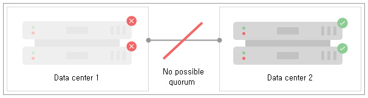

### 4.2.11. 데이터 센터 재해 복구 `Enterprise Edition`
> 이 장에서는 데이터 센터 오류가 발생한 후 Neo4j Causal 클러스터를 복구하는 방법에 대해 설명합니다. 구체적으로 생존하는 소수의 인스턴스를 읽기 전용 상태에서 읽기/쓰기 인스턴스의 완벽한 작동 클러스터로 안전하게 전환하는 방법을 다룹니다.

#### 4.2.11.1. 데이터 센터 손실 시나리오
이 장에서는 외부 환경으로 인해 클러스터가 구성원의 절반 이하로 감소한 다중 데이터 센터 배포를 복구하는 방법에 대해 설명합니다. 이것은 2개의 데이터 센터가 각각 2개의 인스턴스를 포함하는 2x2 배포로 가장 쉽게 대표됩니다. 이 배포 토폴로지는 다른 데이터 센터 오류로 인해 발생하거나 대재앙 계획을 위한 데이터의 지리적 생존을 보장하기 위한 의도적인 선택일 수 있습니다.

정상적인 운영 환경에서 이는 안정적인 과반수 정족수를 제공하며, [그림 4.19, "네 개의 코어 인스턴스가 있는 두 개의 데이터 센터 구축"](#그림-419-네-개의-코어-인스턴스가-있는-두-개의-데이터-센터-구축)에서 강조 표시된 것처럼 네 대의 시스템 중 가장 빠른 세 대의 시스템이 사용자 트랜잭션을 실행할 것입니다.

##### 그림 4.19. 네 개의 코어 인스턴스가 있는 두 개의 데이터 센터 구축

그러나 일부 재해로 인해 전체 데이터 센터가 오프라인 상태가 된다면, 이 경우에는 *과반수 정족수*를 구성 할 수 없습니다.

>> Neo4j 코어 클러스터는 트랜잭션 처리를 위한 Raft 합의 프로토콜을 기반으로 합니다. Raft 프로토콜은 클러스터 및 데이터의 안전을 보장하기 위해 클러스터 구성원 과반수의 동의를 요구합니다. 이에 따라 과반수 정족수가 손실되면 나머지 클러스터 구성원은 읽기 전용 상태가 됩니다.

인스턴스가 정상적으로 종료되는게 아니라 데이터 센터가 장애 발생시 갑작스럽게 손실될 경우에, 살아남은 구성원은 여전히 그들이 더 큰 클러스터의 일부라고 생각합니다. 이는 기본 클러스터 미들웨어에 의해 종종 감지될 수 있는, 라이브 데이터 센터에서 개별 인스턴스가 급속히 실패하는 경우와 다르며 클러스터를 자동으로 재구성할 수 있게 합니다.

반대로 데이터 센터가 손실되면 클러스터가 자동으로 재구성될 기회가 없습니다. 손실은 다른 클러스터 구성원에게 즉시 나타납니다. 그러나 나머지 각 시스템에는 클러스터 상태에 대한 부분적인 뷰만 있기 때문에 개별 시스템이 임의로 클러스터를 재구성하도록 허용하는 것은 안전하지 않습니다.

이 경우에 우리는 정족수를 이룰 수 없어 더이상 진전을 이룰 수 없는 두개의 살아있는 시스템을 가지게 됩니다.

**그림 4.20. 데이터 센터 손실은 안내 복구 필요**

그러나 전체적으로 내려다 볼 때, 우리는 운영자 감독하에 비 결함 허용 클러스터를 형성하기에 충분한 생존하는 시스템을 가지고 있다는 것이 분명합니다.

>> 개별 클러스터 구성원 그룹 (예: 단일 데이터 센터의 구성원 그룹)은 예를 들어 네트워크 파티션 동안 클러스터로부터 고립 될 수 있습니다. 그들이 만약 새로운 더 소규모의 클러스터를 임의로 재구성한다면, *분할 브레인(split-brain)*의 위험이 있습니다. 클라이언트 관점에서 볼 때 파티션의 특성에 따라 읽기 및 쓰기에 사용할 수 있는 *두 개* 이상의 더 작은 클러스터가 있을 수 있습니다. 이러한 상황은 곤란하고 조정하기 힘든 일탈을 초래하므로 피하는 것이 좋습니다.

안전을 위해, 시스템 속성 전체에 대해 신뢰할 수 있는 관점을 지닌 운영자 또는 기타 대역 외 에이전트(예: 이해가 잘되고 신뢰할 만한 경보에 의해 트리거되는 스크립트)가 결정을 내려야 합니다. 생존하는 데이터 센터에서 해당 지점까지 커밋된 모든 데이터를 유지하면서 클러스터가 더 작은 구성으로 재부팅 될 수 있습니다. 최종 사용자는 전환 중에 비가용 상태를 겪을 수 있지만, 커밋 된 데이터는 손실되지 않습니다.

#### 4.2.11.2. 데이터 센터 손실 복구 절차
데이터 센터 복구 수행을 위한 다음 절차는 가볍게 수행해서는 안 됩니다. 이는 재해가 발생했으며 이전에 데이터 센터를 운영하던 클러스터가 단일 데이터 센터에서 읽기 전용 클러스터로 축소되었음을 전적으로 확신한다고 가정합니다. 또한 나머지 클러스터 구성원이 데이터 품질 관점에서 새 클러스터가 생성될 수 있는 시드를 제공하기에 적합하다고 가정합니다.

위의 내용을 이해한 후, 하나의 데이터 센터를 제외한 모든 데이터 센터가 치명적인 손실을 입은 후에 클러스터를 전체 사용가능한 상태로 복원하는 절차는 다음과 같습니다.

1. 재해가 발생했는지, 그리고 살아남은 데이터 센터의 나머지 클러스터 구성원에 액세스 할 수 있는지 확인하십시오. 그런 다음 각 인스턴스에 대해:
2. `bin/neo4j stop`을 사용하여 인스턴스를 중지하거나 서비스를 종료하십시오.
3. [`causal_clustering.initial_discovery_members`](https://neo4j.com/docs/operations-manual/3.3/reference/configuration-settings/#config_causal_clustering.initial_discovery_members) 속성이 다른 생존 인스턴스의 DNS 이름 또는 IP주소를 포함하도록 *neo4j.conf*에서 설정을 변경하십시오.
4. *neo4j.conf* 설정 파일에 [`causal_clustering.expected_core_cluster_size=2`](https://neo4j.com/docs/operations-manual/3.3/reference/configuration-settings/#config_causal_clustering.expected_core_cluster_size) (생존 인스턴스가 2개라고 가정) 설정이 표시되는지 확인하십시오.
5. `bin/neo4j start`를 사용하여 인스턴스를 시작하거나 `neo4j` 서비스를 시작하십시오.

이 절차가 각 인스턴스에 대해 완료되면, 읽기 및 쓰기가 가능한 클러스터가 구성됩니다. 이 시점에서 부하 처리 및 내결함성을 개선하기 위해 다른 클러스터 멤버를 해당 클러스터에 통합할 것을 권장합니다. 클러스터에 맨 처음부터 결합되도록 인스턴스를 구성하는 방법에 대한 자세한 내용은 [4.2.3 장, "새로운 Causal 클러스터 생성"](../create-a-new-causal-cluster.md)을 참조하십시오.
