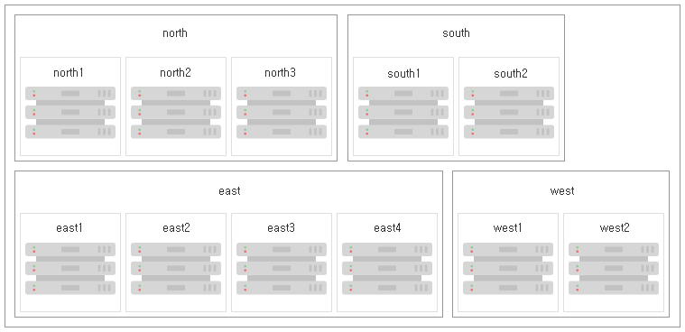

### 4.2.10. 다중 데이터 센터 시스템을 위한 로드 밸런싱 `Enterprise Edition`
> 이 장에서는 다중 데이터 센터 Neo4j 배포에서 클라이언트 애플리케이션에 사용할 수 있는 토폴로지 인식 로드 밸런싱 옵션에 대해 설명합니다. 또한 클라이언트 애플리케이션이 근처의 클러스터 멤버와 같이 가장 적합한 클러스터 멤버로 워크 로드를 보낼 수 있도록 클러스터에 대해 로드 밸런싱을 구성하는 방법을 설명합니다.

>> **로드 밸런싱 활성화**
>>
>> 로드 밸런싱 기능은 별도로 라이센스가 부여된 다중 데이터 센터 패키지의 일부이며 구체적으로 활성화해야 합니다. 자세한 내용은 ["다중 데이터 센터 운영을 위한 라이센스" 장](../multi-data-center.md#다중-데이터-센터-운영을-위한-라이센스)을 참조하십시오.

#### 4.2.10.1. 소개
다중 데이터 센터 클러스터를 배포할 때 우리는 종종 대기 시간을 줄이고 성능을 향상시키기 위해 인접성을 최대한 활용하길 원합니다. 예를 들어, 우리는 그래프 집약적인 워크로드를 WAN 대기 시간의 먼 곳의 데이터 센터가 아닌 LAN 대기 시간의 로컬 데이터 센터에서 실행하고자 합니다. Neo4j의 다중 데이터 센터 시나리오에 대한 향상된 로드 밸런싱은 정확하게 이를 용이하게 하며, 폴백 동작을 정의하는 데에도 사용될 수 있습니다. 즉, 장애를 사전에 계획할 수 있으며 지속적인 과부하 조건을 피할 수 있습니다.

로드 밸런싱 시스템은 워크 로드의 서로 다른 클래스(예: 쓰기 및 읽기)를 지시해야 하는 곳에서 드라이버가 클러스터에 반복적으로 요청하는 협업 시스템입니다. 이를 통해 드라이버는 오랜 시간 독립적으로 작업할 수 있지만, 증가된 수용력을 위해 새로운 서버가 추가된 것과 같은 변화에 적응하도록 수시로 다시 확인합니다. 또한 할당된 서버를 사용할 수 없는 경우와 같이 드라이버가 즉시 다시 요청하는 장애 상황도 있습니다.

이는 대부분 클라이언트의 관점에서 볼 때 투명합니다. 서버 측에서는 로드 밸런싱 동작을 구성하여 드라이버가 바인딩 할 수 있는 명명된 *로드 밸런싱 정책* 하에 그들을 노출합니다. 모든 서버 측 구성은 코어 서버에서 수행됩니다.

>> **Neo4j 드라이버의 로드 밸런싱 사용**
>>
>> 이 장에서는 사용자 정의 로드 밸런싱 정책을 사용하도록 Causal 클러스터를 구성하는 방법에 대해 설명합니다. 일단 활성화 및 구성되면, 의도한대로 트래픽을 라우팅하기 위해 사용자 정의 로드 밸런싱 기능이 드라이버에 의해 사용됩니다. 사용자 정의 로드 밸런싱을 사용하도록 드라이버를 구성하는 방법에 대한 지침은 [드라이버 장](https://neo4j.com/docs/developer-manual/3.3/drivers/client-applications/#driver-connection-uris)을 참조하십시오.

#### 4.2.10.2. 필수 구성
#### 다중 데이터 센터 운영 활성화
로드 밸런싱을 위해 클러스터를 구성하려면 다중 데이터 센터 기능을 활성화해야 합니다. 이는 ["다중 데이터 센터 운영을 위한 라이센스" 장](../multi-data-center.md#다중-데이터-센터-운영을-위한-라이센스)에서 설명합니다.

#### 서버 그룹
[서버 대 서버 캐치업](./configuration.md)과 마찬가지로, 여러 데이터 센터에 걸친 로드 밸런싱은 *서버 그룹* 개념에 기반합니다. 서버는 하나 이상의 잠재적으로 중복되는 서버 그룹에 속할 수 있으며, 클라이언트에서 클러스터 멤버로 요청을 라우팅 할 위치에 대한 결정은 해당 구성을 기반으로 매개 변수화됩니다. 서버 그룹 구성에 대한 자세한 내용은 [4.2.9.2장, "서버 그룹"](./configuration.md#4292-서버-그룹)을 참조하십시오.

#### 읽기 용 코어
읽기 워크 로드를 코어 서버로 라우팅 해야 하는지 여부에 따라, 클러스터에서 배포 및 사용할 수 있는 서버 수에 의존하여 서로 다른 전략이 적용됩니다. 다음 구성을 사용하면 코어 서버로 읽기 워크 로드를 라우팅 할 수 있습니다. 유효한 값은 `true` 및 `false`입니다.

````
causal_clustering.cluster_allow_reads_on_followers=true
````

#### 4.2.10.3. 로드 밸런싱 프레임 워크
로드 밸런싱 시스템은 향후 확장성 및 사용자 정의를 허용하는 플러그인 아키텍처를 기반으로 합니다. 현재 버전에는 *서버 정책* 플러그인이라고 하는 하나의 통조림 플러그인이 제공됩니다.

서버 정책 플러그인은 다음 속성을 설정하여 선택합니다:

```
causal_clustering.load_balancing.plugin=server_policies
```

서버 정책 플러그인에서는 여러 가지 로드 밸런싱 정책을 서버 측에서 구성하고 고유 한 이름으로 드라이버에 노출시킬 수 있습니다. 드라이버는 인스턴스화 시 차례로 이름을 지정하여 적절한 정책을 선택해야 합니다. 이름 지정 정책의 공통 패턴은 지리적 영역 또는 의도된 애플리케이션 그룹 이후입니다.

모든 코어 시스템에 대해 완전히 동일한 정책을 정의하는 것은 매우 중요합니다. 이는 클러스터 전체의 구성으로 간주되며 그렇게하는 것이 실패한다면 놀라운 동작으로 이어질 것이기 때문입니다. 마찬가지로 사용 중인 정책은 이러한 정책을 사용하려는 애플리케이션을 중단시킬 것이기 때문에 제거하거나 이름을 바꾸면 안 됩니다. 그러나 정책이 동일한 이름으로 수정되는 것은 전적으로 수락 가능하고 예상되어집니다.

만일 드라이버가 사용할 수 없는 정책 이름을 요청하면 클러스터를 사용할 수 없습니다. 이름을 전혀 지정하지 않은 드라이버는 구성된 기본 정책의 동작을 가져옵니다. 기본 정책을 변경하지 않고 그대로 두면, 모든 서버에 로드가 분산됩니다. 명명된 정책이 가질 수 있는 모든 동작으로 기본 정책을 변경할 수 있습니다.

잘못 구성된 드라이버 또는 로드 밸런싱 정책은 차선의 라우팅 선택을 이끌하거나 클러스터와의 성공적인 상호 작용을 완전히 차단합니다.

>> 사용자 지정 플러그인을 작성하는 방법에 대한 자세한 내용은 여기에 설명되지 않습니다. 사용자 지정 플러그인이 필요하다고 생각되는 경우, Neo4j 전문 서비스에 연락하십시오.

#### 정책 정의

로드 밸런싱 정책의 구성은 클라이언트 애플리케이션에 투명하며 간소한 DSL을 통해 표현됩니다. 구문은 순서대로 고려되는 규칙 집합으로 구성됩니다. 비어 있지 않은 결과를 생성하는 첫번째 규칙이 최종 결과가 될 것입니다.

```
rule1; rule2; rule3
```

각 규칙은 차례차례 고려된 서버를 제한하는 일련의 필터로 구성되며, 완전한 세트부터 시작합니다. 각 규칙의 평가는 사용 가능한 서버의 완전한 세트에서 새로 시작됩니다.

규칙을 구성하는 고정된 필터 집합이 있으며, 그것들은 화살표를 사용하여 함께 연결됩니다.

```
filter1 -> filter2 -> filter3
```

마지막 필터 이후에 여전히 남은 서버가 있으면, 규칙 평가는 결과를 생성하고 이것은 드라이버에 반환됩니다. 그러나 남아 있는 서버가 없으면 다음 규칙이 고려됩니다. 만약 사용 가능한 결과를 생성할 수 있는 규칙이 없으면 드라이버에 오류가 발생한 것으로 표시됩니다.

#### 정책 이름

정책은 *서버 정책* 플러그인의 네임스페이스에서 구성되고 원하는대로 이름이 지정됩니다. 정책 이름은 영문, 숫자와 밑줄을 포함할 수 있으며 대, 소문자를 구분합니다. 아래는 `mypolicy`라는 이름의 정책에 대한 속성 키입니다.

`causal_clustering.load_balancing.config.server_policies.mypolicy=`

실제 정책은 DSL을 사용하여 값 부분에 정의됩니다.

`default` 정책 이름은 기본 정책에 예약되어 있습니다. 이 정책은 다른 정책과 마찬가지로 구성할 수 있으며 정책을 지정하지 않는 드라이버 클라이언트에 의해 사용됩니다. 또한 고유한 정책 이름을 사용하여 원하는 수의 정책을 만들 수 있습니다. 정책 이름은 특정 지역이나 사용하려는 애플리케이션을 제안할 수 있습니다.

#### 필터

규칙을 지정하는 데 사용할 수 있는 네 가지 필터가 있으며, 자세한 내용은 아래에 나와 있습니다. 구문은 매개 변수가있는 메서드 호출과 비슷합니다.
* `groups(name1, name2, …​)`
  * 지정된 그룹에 속한 서버만 필터를 전달합니다.
  * 정의된 이름은 서버 그룹의 이름과 일치해야 합니다.
* `min(count)`
  * 최소한의 서버만(또는 없음) 통과할 수 있습니다.
  * 과부하 상태를 관리할 수 있습니다.
* `all()`
  * 각 규칙의 시작 부분에 내포되어 있으므로 명시할 필요가 없습니다.
  * 마지막 규칙을 암시합니다(halt를 이용하여 이 동작을 무시).
* `halt()`
  * 마지막 규칙의 마지막 필터로만 사용할 수 있습니다.
  * 더 이상의 규칙 처리를 중지합니다.

그룹 필터는 기본적으로 OR 필터입니다. 예: `groups(A,B)`. 이는 A, B 또는 둘 모두(서버 그룹 연합)에서 모든 서버를 전달합니다. 또한 AND 필터는 `groups(A) -> groups(B)`에서와 같이 두 개의 필터를 연결하여 생성할 수 있으며, 이는 오직 두 그룹(서버 그룹의 교차점)에서만 서버를 전달할 것입니다.  

#### 4.2.10.4. 로드 밸런싱 예제

[다중 데이터 센터 클러스터에 대한 논의](./configuration.md#사용자-정의-전략-구성하기)에서 우리는 4개 지역, 다중 데이터 센터 설정을 소개했습니다. 우리는 지역과 그 지역 내에 번호가 매겨진 데이터 센터를 위해 기본 나침반 포인트를 사용했습니다. 여기서도 동일한 가상의 설정을 사용할 것입니다.

그림 4.18. 서버 그룹에 대한 지역 및 데이터 센터 매핑


`causal_clustering.load_balancing.config.server_policies.<policy-name>` 속성에서 로드 밸런서의 동작을 구성합니다. 우리가 지정하는 규칙은 클러스터가 로드할 때 요청을 라우팅하는 방식을 세밀하게 조정할 수 있게 해줍니다.

예제에서는 읽기 쉽도록 줄 연속 문자 `\`를 사용하겠습니다. [*neo4j.conf*](../../../configuration/file-locations.md)에서도 유효한 문법이며, 모든 줄에서 이것과 새 규칙을 사용하여 복잡한 규칙 정의를 분할하는 것이 좋습니다.

가장 제한적인 전략은 다른 모든 데이터 센터를 배제하도록 특정 데이터 센터를 고집하는 것입니다:

**예제 4.16. 특정 데이터 센터만 사용**

--------------------------------------

``````````````
causal_clustering.load_balancing.config.server_policies.north1_only=\
groups(north1)->min(2); halt();
```````````````

이 사례에서 우리는 사용 가능한 서버가 두대 있는 경우에 특정 물리적 데이터 센터에 매핑되는 `north1` 서버 그룹의 서버에 쿼리를 보내는 데에만 관심이 있다는 것을 언급하고 있습니다. `north1`에서 적어도 두대의 서버를 제공할 수 없다면, 다른 데이터 센터를 시도하지 말고 `halt()`를 수행해야 합니다.

------------------------------------------

이전 예제에서는 로드 밸런싱 규칙의 기본 형식을 보여 주지만, 우리는 좀 더 확장할 수 있습니다:

**예제 4.17. 가급적 특정 데이터 센터 사용**

--------------------------------------------------------

````
causal_clustering.load_balancing.config.server_policies.north1=\
groups(north1)->min(2);
````

이 경우, `north1` 데이터 센터에 최소 두대의 서버가 사용 가능하면 서버 간에 로드 밸런싱을 수행합니다. 그렇지 않으면 암시적인 최종 `all()` 규칙으로 돌아가서 전체 클러스터에서 아무 서버나 사용합니다.

-------------------------------------

이전 예제에서는 전체 클러스터를 사용하기 전에 단일 데이터 센터만 고려했습니다. 만일 서버 그룹을 통해 노출된 계층 구조 또는 지역 개념이 있다면 폴백을 보다 우아하게 만들 수 있습니다:

**예제 4.18. 이웃으로 우아하게 폴백하기**

------------------------------------
````
causal_clustering.load_balancing.config.server_policies.north_app1=\
groups(north1,north2)->min(2);\
groups(north);\
all();
````

이 예제에서 우리는 그들 사이에서 사용할 수 있는 시스템이 최소 두대 있는 경우, 클러스터가 `north1`과 `north2` 데이터 센터 간에 로드 밸런싱을 수행해야 한다는 것을 말합니다. 그것이 실패하면 `north` 지역의 모든 인스턴스에 의존할 것이고, 만일 north 전체가 오프라인이라면 클러스터에 있는 아무 인스턴스나 사용하게 됩니다.

---------------------------------------------
