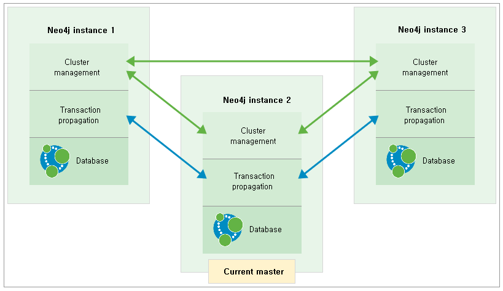

### 4.3.1. 고 가용성 `Enterprise Edition`
> 이 장에서는 Neo4j HA 클러스터의 아키텍처에 대해 설명합니다.

Neo4j 클러스터는 단일 마스터 인스턴스와 0 개 이상의 슬레이브 인스턴스로 구성됩니다. 클러스터의 모든 인스턴스는 로컬 데이터베이스 파일에 전체 데이터 복사본을 가지고 있습니다. 기본 클러스터 구성은 세 개의 인스턴스로 구성됩니다:

**그림 4.3.1. Neo4j 클러스터**

각 인스턴스에는 위의 그림에 녹색 화살표로 표시된 데이터 복제 및 선출 관리를 위한 클러스터의 다른 멤버들과의 조정에 필요한 논리가 포함되어 있습니다. 위 그림의 파란색 화살표로 표시된 것 처럼, arbiter 인스턴스(아래 참조)가 아닌 각 슬레이브 인스턴스는 마스터와 통신하여 데이터베이스를 최신 상태로 유지합니다.

#### 4.3.1.1. Arbiter 인스턴스
슬레이브 인스턴스의 특별 케이스가 arbiter 인스턴스입니다. arbiter 인스턴스는 arbiter 모드에서 실행되는 전체 Neo4j 소프트웨어로 구성되어 클러스터 통신에 참여하지만 데이터 저장소의 사본을 복제하지는 않습니다.

#### 4.3.1.2. 트랜잭션 전파
마스터에서 직접 수행되는 쓰기 트랜잭션은 인스턴스가 클러스터 모드가 아닌 모드에서 실행 중인 것처럼 실행됩니다. 성공하면 트랜잭션은 구성 가능한 번호의 슬레이브로 푸시됩니다. 이것은 낙관적으로 이루어지는데, 이것은 만약 푸시가 실패하더라도 트랜잭션은 여전히 성공할 것이라는 것을 의미합니다.

슬레이브에서 쓰기 트랜잭션을 수행 할 때 각 쓰기 작업은 마스터와 동기화됩니다. 잠금 장치는 마스터와 슬레이브 모두에 설정될 것입니다. 트랜잭션이 커밋되면 먼저 마스터에서 커밋되고, 이것이 성공하면 슬레이브에서 커밋됩니다. 일관성을 유지하기 위해서는, 쓰기 작업을 수행하기 전에 슬레이브가 마스터와 함께 최신 상태여야 합니다. 슬레이브의 자동 업데이트는 슬레이브와 마스터 사이의 통신 프로토콜에 내장되어 있습니다.

#### 4.3.1.3. 장애 조치
예를 들어 하드웨어 장애 또는 네트워크 중단으로 인해 Neo4j 데이터베이스를 사용할 수 없게되면 클러스터의 다른 인스턴스가 이를 감지하고 일시적으로 실패한 것으로 표시합니다. 운영 중단 이후 사용 가능하게 된 데이터베이스 인스턴스는 자동으로 클러스터를 따라 잡습니다.

만약 마스터가 다운되면 클러스터 내에서 정족수(아래 참조)에 도달 한 후 또다른 멤버가 선출되고 그것의 역할이 슬레이브에서 마스터로 전환됩니다. 새 마스터가 역할 전환을 수행하면 클러스터의 다른 모든 멤버들에게 해당 가용성이 방송됩니다. 일반적으로 새로운 마스터는 몇 초 안에 선출되고 시작됩니다. 이 시간 동안은 쓰기가 수행되지 않습니다.

##### 정족수
새로운 마스터를 선출하기 위해서는 클러스터가 정족수를 가져야합니다. 정족수는 다음과 같이 정의됩니다: *활성 클러스터 멤버들의 50 % 이상*. 클러스터 설계 시 간단한 경험 법칙은 다음과 같습니다: **n**개의 마스터 인스턴스 오류를 허용해야 하는 클러스터는 정족수를 충족시키고 선출을 허용하기 위해 **2n+1**개의 인스턴스가 필요합니다. 따라서 가장 간단하고 유효한 클러스터 크기는 단일 마스터 실패를 허용하는 세 개의 인스턴스입니다.

##### 선출 규칙
