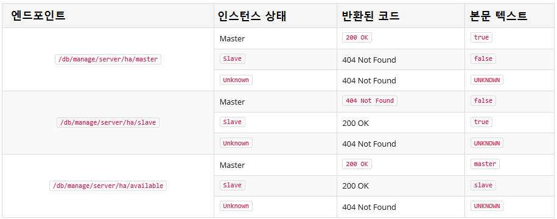

### 4.3.4. 상태 정보의 엔드포인트 `Enterprise Edition`
> 이 장에서는 Neo4j HA 클러스터에 사용 가능한 엔드포인트를 설명합니다.

#### 4.3.4.1. 소개
Neo4j HA 클러스터의 일반적인 사용 사례는 읽기 작업에 슬레이브를 사용하는 동안 모든 쓰기 요청을 마스터로 보내고 클러스터 전체에 읽기 로드를 분산하고 배포를 위한 장애 조치 기능을 얻는 것입니다. 이를 달성하는 가장 일반적인 방법은 HA 클러스터 앞에 로드 밸런서를 배치하는 것입니다. 이 예는 [HA 프록시](./haproxy-for-load-balancing.md)에서 보여집니다. 이 가이드에서 볼 수 있듯이 HTTP 엔드포인트를 사용하여 어느 인스턴스가 마스터이고 어떤 인스턴스가 해당 인스턴스에 직접 쓰기 로드되는지 발견합니다. 이 장에서는이 HTTP 엔드포인트를 다루고 그 의미를 설명합니다.

#### 4.3.4.2. 엔드포인트
각 HA 인스턴스에는 HA 상태와 관련된 3개의 엔드포인트가 있습니다. 이러한 기능은 무료로 제공되지만 각 기능은 로드 밸런싱 요구 사항과 운영 설정에 따라 사용될 수 있습니다. 그들은 다음과 같습니다:
* /db/manage/server/ha/master
* /db/manage/server/ha/slave
* /db/manage/server/ha/available

/master 및 /slave 엔드포인트를 사용하여 특정 인스턴스에 쓰기 및 비 쓰기 트래픽을 각각 전달할 수 있습니다. 이것은 Neo4j의 스케일링 특성의 장점을 활용하는 최적의 방법입니다. /available 엔드포인트는 트랜잭션 처리에 사용할 수있는 인스턴스에 임의의 요청 유형을 전달하는 일반적인 경우를 위해 존재합니다.
엔드포인트를 사용하기 위해, 둘 중 하나에서 HTTP GET 작업을 수행하면 다음이 반환됩니다:

##### 표 4.2. HA HTTP 엔드포인트 응답


#### 4.3.4.3. 예제
커맨드 라인에서 이러한 엔드포인트를 요청하는 일반적인 방법은 curl을 사용하는 것입니다. 인수를 사용하지 않을 경우 curl은 제공된 URI에 대해 HTTP GET을 수행하고 본문 텍스트가 있는 경우 해당 텍스트를 출력합니다. 만일 응답 코드를 얻고 싶다면 자세한 출력을 위해 -v 플래그를 추가하십시오. 여기 몇 가지 예가 있습니다:
* 자세한 출력과 함께 실행중인 마스터에서 마스터 엔드포인트 요청<br>
```
#> curl -v localhost:7474/db/manage/server/ha/master
* About to connect() to localhost port 7474 (#0)
*   Trying ::1...
* connected
* Connected to localhost (::1) port 7474 (#0)
> GET /db/manage/server/ha/master HTTP/1.1
> User-Agent: curl/7.24.0 (x86_64-apple-darwin12.0) libcurl/7.24.0 OpenSSL/0.9.8r zlib/1.2.5
> Host: localhost:7474
> Accept: */*
>
< HTTP/1.1 200 OK
< Content-Type: text/plain
< Access-Control-Allow-Origin: *
< Transfer-Encoding: chunked
< Server: Jetty(6.1.25)
<
* Connection #0 to host localhost left intact
true* Closing connection #0
```

* 자세한 출력없이 실행중인 마스터에서 슬레이브 엔드포인트 요청<br>
```
#> curl localhost:7474/db/manage/server/ha/slave
false
```

* 마지막으로, 자세한 출력과 함께 슬레이브에서 마스터 엔드포인트 요청<br>
```
#> curl -v localhost:7475/db/manage/server/ha/master
* About to connect() to localhost port 7475 (#0)
*   Trying ::1...
* connected
* Connected to localhost (::1) port 7475 (#0)
> GET /db/manage/server/ha/master HTTP/1.1
> User-Agent: curl/7.24.0 (x86_64-apple-darwin12.0) libcurl/7.24.0 OpenSSL/0.9.8r zlib/1.2.5
> Host: localhost:7475
> Accept: */*
>
< HTTP/1.1 404 Not Found
< Content-Type: text/plain
< Access-Control-Allow-Origin: *
< Transfer-Encoding: chunked
< Server: Jetty(6.1.25)
<
* Connection #0 to host localhost left intact
false* Closing connection #0
```

<span class="glyphicon glyphicon-info-sign" aria-hidden="true"> </span> ##### Unknown 상태
`UNKNOWN` 상태는 Neo4j 인스턴스가 마스터도 슬레이브도 아닌 경우를 설명하기 위해 존재합니다. 예를 들어, 인스턴스는 상태(복구 시나리오에서 마스터가 슬레이브로 전환 또는 장애 발생시 슬레이브가 마스터로 승격됨) 사이에서 전환되는 중이거나 인스턴스가 arbiter 인스턴스가 될 수 있습니다. 만일 `UNKNOWN` 상태가 반환되면, 클라이언트는 인스턴스를 마스터 또는 슬레이브로 취급해서는 안 되며, 대신 클러스터에서 사용하도록 다른 인스턴스를 선택하거나 `UNKNOWN` 상태에서 인스턴스가 전송 될 때까지 기다리거나 시스템 관리자를 통해 복구 작업을 수행해야 합니다.

Neo4j 서버에 기본 보안 기능이 사용하도록 설정된 경우, HA 상태 엔드포인트에는 인증 자격 중명 또한 필요합니다. 일부 로드 밸런서 및 프록시 서버의 경우 요청과 함께 이것을 제공하는 것은 좋지 않습니다. 이러한 경우 `neo4j.conf` 구성 파일에서 `dbms.security.ha_status_auth_enabled=false`를 설정하여 HA 상태 엔드포인트의 인증을 비활성화하는 것을 고려하십시오.
