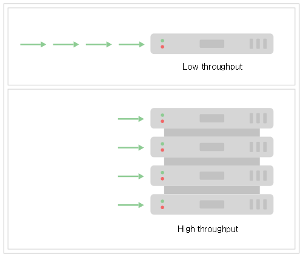
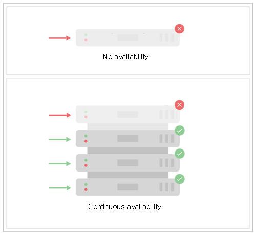
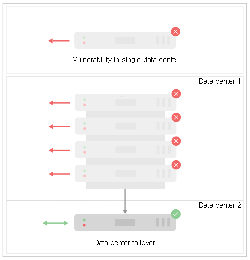

## 4.1. 클러스터링 소개 `Enterprise Edition`
> 이 장에서는 엔터프라이즈 배포에 클러스터링을 사용하는 방법을 소개합니다.

엔터프라이즈 IT 요구 사항은 까다롭습니다. 우리의 솔루션은 높은 처리량, 지속적인 가용성 및 신뢰성을 제공하도록 기대되어 집니다. 또한 대부분의 IT 에코 시스템에서는 분석 및 보고 목적으로 운영 데이터에서 종종 장기 실행 쿼리를 실행하고자 합니다. 우리의 솔루션을 설계할 때, 우리는 우리가 선택한 모든 기술이 그러한 중요 엔터프라이즈 요구 사항을 뒷받침 할 수 있다는 것을 보장하여야 합니다.

#### 높은 처리량
까다로운 그래프 작업량을 충족시키기 위해 Neo4j 클러스터를 사용하면 여러 협력 시스템에서 작업을 연합 할 수 있습니다.

##### 그림 4.1. 처리량

클러스터 환경에서 각 컴퓨터가 전체 쿼리의 하위 집합을 처리 할 수 있게하여 처리량 목표 (그래프 쿼리)를 충족시킬 수 있습니다. 이 방식을 사용하면 위의 다이어그램에서 (논리적) 큐 길이를 기준으로 지연 시간도 줄일 수 있습니다.

#### 지속적인 가용성
대부분의 엔터프라이즈 급 시스템에 대한 기본 요구 사항은 고 가용성입니다. 즉, 장애가 있더라도 시스템은 최종 사용자(사람 또는 다른 컴퓨터 시스템)에게 기능을 계속 제공합니다.

##### 그림 4.2. 가용성

Neo4j의 클러스터링 아키텍처는 Neo4j의 지속적인 가용성을 보장하기 위한 자동화 된 솔루션입니다. 전제는 클러스터에 중복을 배치하여 장애가 발생할 경우 나머지 라이브 인스턴스에 의해 마스킹 될 수 있다는 것입니다. 위의 경우 하나의 실패한 인스턴스로 인해 클러스터가 중지되지 않습니다 (클러스터의 처리량은 더 낮아질 수 있음).

#### 재해 복구
재해 복구는 주요 서비스 중단으로부터 복구할 수 있는 기능이며, 지속적으로 사용 가능한 클러스터에서 여분의 용량으로 수용 할 수 있는 것보다 더 큰 기능입니다. 일반적으로 이는 데이터 센터 중단, 물리적 네트워크 단절 또는 대용량 인프라가 작동 불가능하게 만드는 서비스 거부(DoS) 공격으로 나타납니다.

##### 그림 4.3. 안전성

이러한 경우 재해 복구 전략은 서비스를 다시 온라인 상태로 전환하는 전략과 함께 장애 조치 데이터 센터를 정의 할 수 있습니다. Neo4j 클러스터링은 다운 타임이 매우 짧아야 하거나 재해 시나리오에서 데이터 손실에 대한 허용 오차가 낮아야 하는 재해 복구 전략을 수용할 수 있습니다. 클러스터 인스턴스를 대체 위치에 배포하면 지정된 재해 복구 위치에 운영 데이터베이스 클러스터에 대해 실행되는 트랜잭션과 함께 최신 상태인 사용할 수 있는 활성 데이터베이스 복사본이 생성됩니다.
